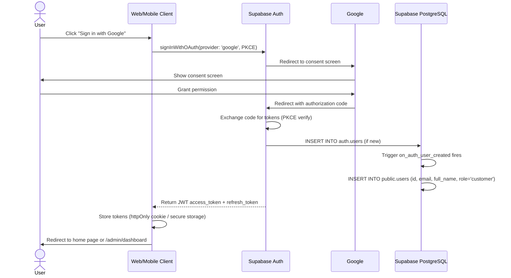

# Flow: Google OAuth Sign-In

> Regenerated from `docs/05-sequence-diagrams.md` SEQ-001 (labels updated
> Express → Fastify per finalized stack). Ref: UC-A-002, FR-AUTH-002/004/010.

**Key facts:**
- Admin role is NEVER set via OAuth — first admin promoted by direct SQL
  (docs/09 §9), subsequent admins via `PATCH /admin/users/{id}` by an existing admin.
- Mobile (RN + Expo) uses native `signInWithIdToken` via
  `@react-native-google-signin` — not WebView; same DB trigger applies.
- Tokens: 15-min access JWT, refresh rotation + reuse detection enabled
  (NFR-SEC-013).
