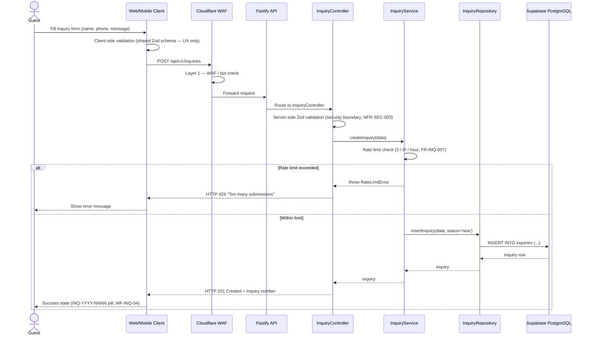

# Flow: Submit Product Inquiry (Guest)

> Regenerated from `docs/05-sequence-diagrams.md` SEQ-002 (labels updated
> Express → Fastify per finalized stack). Ref: UC-G-007, FR-INQ-001…007.

**Key facts:**
- No authentication required (FR-INQ-001); `product_id` optional.
- RLS allows anon INSERT but forces `status='new'`; only admin can SELECT/UPDATE.
- Client and server validate with the SAME Zod schema from
  `packages/validation-schemas` — server never trusts the client ran it.
- Exact field validation messages are locked in docs/07 §3.6.2.
