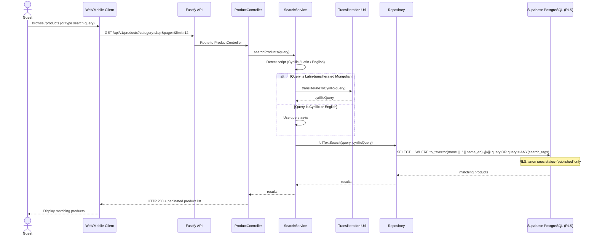

# Flow: Product Browse & Multi-Script Search

> Regenerated from `docs/phase-0/05-sequence-diagrams.md` SEQ-003 (labels updated
> Express → Fastify per finalized stack). Ref: FR-PUB-001/002/013/014,
> UC-G-002/003. Browsing and searching share this path — search adds the
> transliteration branch.

**Key facts:**
- `search_tags` (text[]) holds admin-managed Latin transliterations + synonyms,
  e.g. `['nogoon dar eh', 'green tara', 'tara statue']` (FR-PUB-015).
- Transliteration is a pure function — no external API, keeps reads <500ms
  (NFR-PERF-004).
- Filters/search/page are always reflected in the URL query (WF-LIST-02) —
  links shareable.
