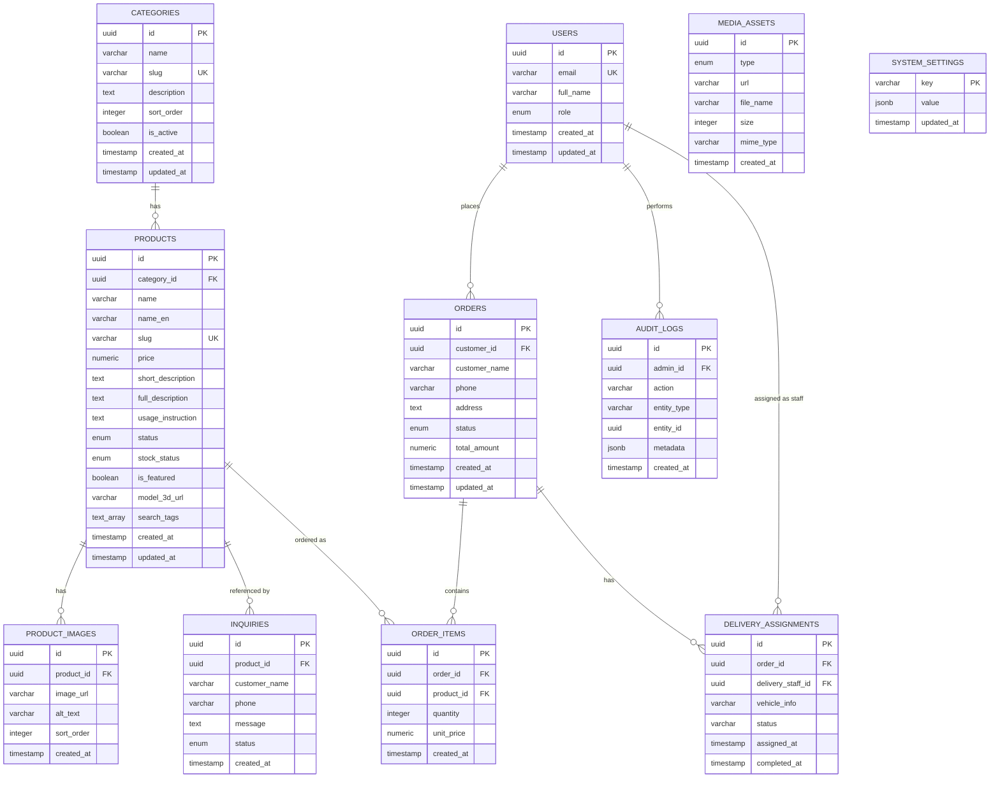

# Entity-Relationship Diagram

**Document:** `docs/04-er-diagram.md`  
**Project:** Nogoolin — Premium Religious Product Catalog Platform  
**Version:** 1.0.0  
**Status:** Draft  
**Author:** Tengis (Solo Developer)  
**Last Updated:** June 2026  
**Depends On:** [`docs/02-requirements.md`](./02-requirements.md)

---

## Changelog

| Version | Date | Type | Description |
|---|---|---|---|
| 1.0.0 | June 2026 | MAJOR | Initial version. 11 entities including future order/delivery tables (W priority). Includes `name_en` and `search_tags` for multi-script search (FR-PUB-013). |

---

## Table of Contents

1. [Overview](#1-overview)
2. [ER Diagram](#2-er-diagram)
3. [Entity Descriptions](#3-entity-descriptions)
4. [Relationships Summary](#4-relationships-summary)
5. [Design Decisions](#5-design-decisions)
6. [Indexing Strategy](#6-indexing-strategy)
7. [Future Tables (Phase 5+)](#7-future-tables-phase-5)

---

## 1. Overview

This document defines the relational database schema for the Nogoolin platform on Supabase PostgreSQL. It covers all 11 entities identified in the master plan, including 3 future-only tables (`orders`, `order_items`, `delivery_assignments`) that are created in the initial migration but remain unused until `delivery_enabled = true` (NFR-SCA-003).

This diagram reflects requirements v1.2.0, including the `name_en` and `search_tags` fields added for multi-script (Cyrillic/Latin/English) search (FR-PUB-013, FR-PUB-014, FR-PUB-015).

---

## 2. ER Diagram



---

## 3. Entity Descriptions

### 3.1 USERS

| Field | Type | Constraints | Description |
|---|---|---|---|
| `id` | uuid | PK | Matches `auth.users.id` (Supabase Auth) |
| `email` | varchar | UNIQUE, NOT NULL | |
| `full_name` | varchar | NULL | |
| `role` | enum | NOT NULL, default `customer` | `customer` \| `admin` \| `delivery_staff` *(delivery_staff — W, future)* |
| `created_at` | timestamp | NOT NULL | |
| `updated_at` | timestamp | NOT NULL | |

> `guest` is not persisted — it represents unauthenticated visitors.

---

### 3.2 CATEGORIES

| Field | Type | Constraints | Description |
|---|---|---|---|
| `id` | uuid | PK | |
| `name` | varchar | NOT NULL | |
| `slug` | varchar | UNIQUE, NOT NULL | URL-safe (FR-CAT-005) |
| `description` | text | NULL | |
| `sort_order` | integer | default 0 | FR-CAT-006 |
| `is_active` | boolean | default true | FR-CAT-003 |
| `created_at` | timestamp | NOT NULL | |
| `updated_at` | timestamp | NOT NULL | |

---

### 3.3 PRODUCTS

| Field | Type | Constraints | Description |
|---|---|---|---|
| `id` | uuid | PK | |
| `category_id` | uuid | FK → categories.id, NOT NULL | One category per product (FR-PROD-008) |
| `name` | varchar | NOT NULL | Cyrillic Mongolian name |
| `name_en` 🆕 | varchar | NULL | English name (FR-PUB-013, v1.2.0) |
| `slug` | varchar | UNIQUE, NOT NULL | Auto-generated (FR-PROD-007) |
| `price` | numeric | NOT NULL | |
| `short_description` | text | NULL | |
| `full_description` | text | NULL | |
| `usage_instruction` | text | NULL | Markdown content (FR-PROD-010) |
| `status` | enum | NOT NULL, default `draft` | `draft` \| `published` \| `archived` |
| `stock_status` | enum | NOT NULL, default `in_stock` | `in_stock` \| `out_of_stock` \| `pre_order` |
| `is_featured` | boolean | default false | FR-PROD-006 |
| `model_3d_url` | varchar | NULL | Supabase Storage URL to GLB (FR-MEDIA-007) |
| `search_tags` 🆕 | text[] | NULL | Latin transliteration + tags (FR-PUB-013) |
| `created_at` | timestamp | NOT NULL | |
| `updated_at` | timestamp | NOT NULL | |

---

### 3.4 PRODUCT_IMAGES

| Field | Type | Constraints | Description |
|---|---|---|---|
| `id` | uuid | PK | |
| `product_id` | uuid | FK → products.id, NOT NULL, ON DELETE CASCADE | |
| `image_url` | varchar | NOT NULL | |
| `alt_text` | varchar | NULL | NFR-SEO-009 |
| `sort_order` | integer | default 0 | First image = primary/thumbnail (FR-MEDIA-005) |
| `created_at` | timestamp | NOT NULL | |

---

### 3.5 MEDIA_ASSETS

| Field | Type | Constraints | Description |
|---|---|---|---|
| `id` | uuid | PK | |
| `type` | enum | NOT NULL | `image` \| `video` \| `model_3d` |
| `url` | varchar | NOT NULL | |
| `file_name` | varchar | NOT NULL | |
| `size` | integer | NULL | bytes |
| `mime_type` | varchar | NULL | |
| `created_at` | timestamp | NOT NULL | |

> Standalone table — for site-wide assets (e.g. the Green Tara 3D intro model), not tied to a specific product via FK.

---

### 3.6 SYSTEM_SETTINGS

| Field | Type | Constraints | Description |
|---|---|---|---|
| `key` | varchar | PK | e.g. `delivery_enabled` |
| `value` | jsonb | NOT NULL | |
| `updated_at` | timestamp | NOT NULL | |

Seed row: `{ key: 'delivery_enabled', value: false }`

---

### 3.7 INQUIRIES

| Field | Type | Constraints | Description |
|---|---|---|---|
| `id` | uuid | PK | |
| `product_id` | uuid | FK → products.id, NULL, ON DELETE SET NULL | Optional reference (FR-INQ-002) |
| `customer_name` | varchar | NOT NULL | |
| `phone` | varchar | NOT NULL | |
| `message` | text | NULL | |
| `status` | enum | NOT NULL, default `new` | `new` \| `contacted` \| `closed` |
| `created_at` | timestamp | NOT NULL | |

---

### 3.8 ORDERS *(W — future)*

| Field | Type | Constraints | Description |
|---|---|---|---|
| `id` | uuid | PK | |
| `customer_id` | uuid | FK → users.id, NOT NULL | |
| `customer_name` | varchar | NOT NULL | |
| `phone` | varchar | NOT NULL | |
| `address` | text | NOT NULL | |
| `status` | enum | NOT NULL, default `pending` | `pending` \| `confirmed` \| `delivering` \| `completed` \| `cancelled` |
| `total_amount` | numeric | NOT NULL | |
| `created_at` | timestamp | NOT NULL | |
| `updated_at` | timestamp | NOT NULL | |

---

### 3.9 ORDER_ITEMS *(W — future)*

| Field | Type | Constraints | Description |
|---|---|---|---|
| `id` | uuid | PK | |
| `order_id` | uuid | FK → orders.id, NOT NULL, ON DELETE CASCADE | |
| `product_id` | uuid | FK → products.id, NOT NULL | |
| `quantity` | integer | NOT NULL | |
| `unit_price` | numeric | NOT NULL | Snapshot of price at order time |
| `created_at` | timestamp | NOT NULL | |

---

### 3.10 DELIVERY_ASSIGNMENTS *(W — future)*

| Field | Type | Constraints | Description |
|---|---|---|---|
| `id` | uuid | PK | |
| `order_id` | uuid | FK → orders.id, NOT NULL | |
| `delivery_staff_id` | uuid | FK → users.id, NOT NULL | role = `delivery_staff` |
| `vehicle_info` | varchar | NULL | |
| `status` | varchar | NOT NULL | |
| `assigned_at` | timestamp | NOT NULL | |
| `completed_at` | timestamp | NULL | |

---

### 3.11 AUDIT_LOGS

| Field | Type | Constraints | Description |
|---|---|---|---|
| `id` | uuid | PK | |
| `admin_id` | uuid | FK → users.id, NOT NULL | |
| `action` | varchar | NOT NULL | e.g. `DELIVERY_TOGGLE`, `PRODUCT_PUBLISH` |
| `entity_type` | varchar | NOT NULL | e.g. `product`, `system_settings` |
| `entity_id` | uuid | NULL | |
| `metadata` | jsonb | NULL | e.g. `{ from: false, to: true }` |
| `created_at` | timestamp | NOT NULL | |

> Append-only (FR-AUD-003) — enforced via RLS policy (no UPDATE/DELETE grants for any role).

---

## 4. Relationships Summary

| Relationship | Type | Notes |
|---|---|---|
| categories → products | 1:N | A product belongs to exactly one category (FR-PROD-008) |
| products → product_images | 1:N | Cascade delete |
| products → inquiries | 1:N (optional) | `product_id` nullable |
| products → order_items | 1:N | Future |
| orders → order_items | 1:N | Cascade delete, future |
| orders → delivery_assignments | 1:N | Future |
| users → orders | 1:N | Future (customer's orders) |
| users → delivery_assignments | 1:N | Future (staff assignments) |
| users → audit_logs | 1:N | Admin who performed the action |

`media_assets` and `system_settings` have no FK relationships — standalone reference tables.

---

## 5. Design Decisions

| Decision | Rationale |
|---|---|
| Single category per product (no junction table) | FR-PROD-008; simplicity for MVP. A `product_categories` junction table can be introduced later without breaking existing queries. |
| `media_assets` is standalone, not FK'd to products | Used for site-wide assets (3D intro model, hero images) distinct from per-product media (`product_images`, `model_3d_url`). |
| `search_tags` as `text[]` rather than separate tags table | Simpler for MVP; admin-managed per product (FR-PUB-015). A normalized `tags` table can be introduced in Phase 6+ if tag analytics are needed. |
| Future tables (`orders`, `order_items`, `delivery_assignments`) created in initial migration | NFR-SCA-003 — enables delivery toggle activation without schema migration later. |
| `inquiries.product_id` nullable | Allows general contact inquiries not tied to a specific product. |
| All tables use `uuid` PKs | Matches Supabase Auth convention (`auth.users.id` is uuid); avoids sequential ID enumeration (IDOR mitigation, NFR-SEC-010). |

---

## 6. Indexing Strategy

```sql
-- Multi-script search (FR-PUB-014)
CREATE INDEX idx_products_search
  ON products
  USING GIN (to_tsvector('simple', coalesce(name, '') || ' ' || coalesce(name_en, '')));

CREATE INDEX idx_products_search_tags
  ON products USING GIN (search_tags);

-- Standard lookups
CREATE INDEX idx_products_category ON products (category_id);
CREATE INDEX idx_products_status ON products (status);
CREATE UNIQUE INDEX idx_products_slug ON products (slug);
CREATE UNIQUE INDEX idx_categories_slug ON categories (slug);

-- Inquiry admin filtering (FR-INQ-006)
CREATE INDEX idx_inquiries_status ON inquiries (status);
CREATE INDEX idx_inquiries_created_at ON inquiries (created_at DESC);

-- Audit log sorting (FR-AUD-004)
CREATE INDEX idx_audit_logs_created_at ON audit_logs (created_at DESC);

-- Future: order lookups
CREATE INDEX idx_orders_customer ON orders (customer_id);
CREATE INDEX idx_orders_status ON orders (status);
```

---

## 7. Future Tables (Phase 5+)

The `orders`, `order_items`, and `delivery_assignments` tables are defined here for architectural completeness but:

- Created with RLS enabled and policies in place from day one (migration runs in Phase 1)
- Remain empty / unused while `delivery_enabled = false`
- API routes touching these tables are gated by `system_settings.delivery_enabled` (FR-SET-004, FR-ORD-008, UC-SYS-002)
- No schema changes required when delivery is activated — only the toggle and frontend UI changes (NFR-SCA-003)

---

*Previous document: [`docs/03-use-cases.md`](./03-use-cases.md)*  
*Next document: [`docs/05-sequence-diagrams.md`](./05-sequence-diagrams.md)*