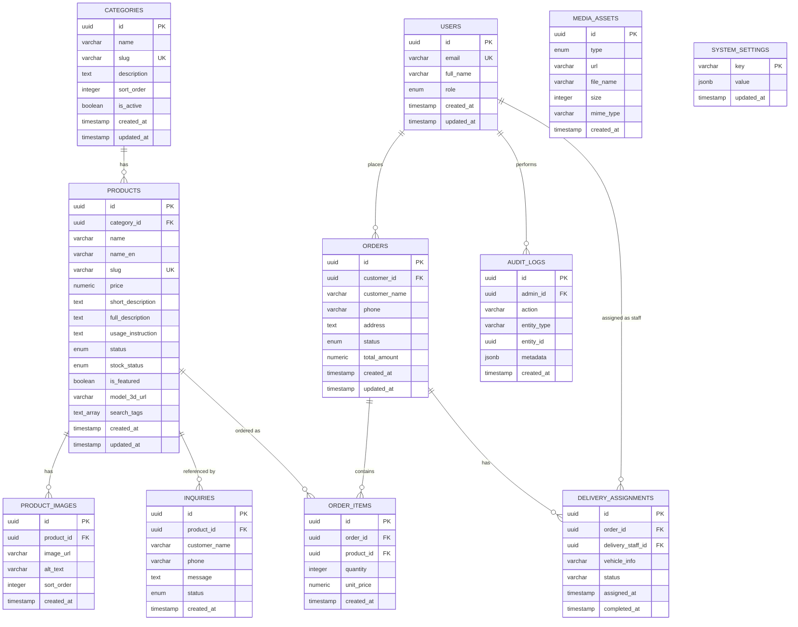

# Entity-Relationship Диаграм

**Баримт бичиг:** `docs/04-er-diagram.mn.md`  
**Төсөл:** Ногоолин — Шашны Бүтээгдэхүүний Каталог Платформ  
**Хувилбар:** 1.0.0  
**Төлөв:** Ноорог  
**Зохиогч:** Тэнгис (Хөгжүүлэгч)  
**Сүүлд шинэчилсэн:** 2026 оны 6-р сар  
**Хамааралтай баримт:** [`docs/02-requirements.mn.md`](./02-requirements.mn.md)

---

## Өөрчлөлтийн Түүх

| Хувилбар | Огноо | Төрөл | Тайлбар |
|---|---|---|---|
| 1.0.0 | 2026 оны 6-р сар | MAJOR | Анхны хувилбар. Ирээдүйн захиалга/хүргэлтийн 3 хүснэгтийг (W priority) оруулсан нийт 11 entity. Олон бичгийн системийн хайлтад зориулсан `name_en` болон `search_tags` талбарууд (FR-PUB-013) оруулсан. |

---

## Гарчгийн Жагсаалт

1. [Тойм](#1-тойм)
2. [ER Диаграм](#2-er-диаграм)
3. [Entity-үүдийн Тайлбар](#3-entity-үүдийн-тайлбар)
4. [Харилцааны Тойм](#4-харилцааны-тойм)
5. [Дизайны Шийдвэрүүд](#5-дизайны-шийдвэрүүд)
6. [Индексийн Стратеги](#6-индексийн-стратеги)
7. [Ирээдүйн Хүснэгтүүд (5-р Шат+)](#7-ирээдүйн-хүснэгтүүд-5-р-шат)

---

## 1. Тойм

Энэхүү баримт бичиг нь Ногоолин платформын Supabase PostgreSQL дээрх харилцааны (relational) мэдээллийн сангийн схемийг тодорхойлно. Master plan-д тодорхойлсон 11 entity бүгдийг хамруулсан бөгөөд үүнд `delivery_enabled = true` болтол ашиглагдахгүй 3 ирээдүйн хүснэгт (`orders`, `order_items`, `delivery_assignments`) орно — эдгээр хүснэгтүүд анхны migration-д л үүсгэгдэнэ (NFR-SCA-003).

Энэ диаграм нь шаардлагын v1.2.0-ийг тусгасан бөгөөд олон бичгийн системийн (кирилл/латин/англи) хайлтад зориулсан `name_en` болон `search_tags` талбаруудыг агуулна (FR-PUB-013, FR-PUB-014, FR-PUB-015).

---

## 2. ER Диаграм



---

## 3. Entity-үүдийн Тайлбар

### 3.1 USERS

| Талбар | Төрөл | Хязгаарлалт | Тайлбар |
|---|---|---|---|
| `id` | uuid | PK | `auth.users.id`-тай тохирно (Supabase Auth) |
| `email` | varchar | UNIQUE, NOT NULL | |
| `full_name` | varchar | NULL | |
| `role` | enum | NOT NULL, анхдагч `customer` | `customer` \| `admin` \| `delivery_staff` *(delivery_staff — W, ирээдүй)* |
| `created_at` | timestamp | NOT NULL | |
| `updated_at` | timestamp | NOT NULL | |

> `guest` мэдээллийн санд хадгалагдахгүй — энэ нь нэвтрээгүй зочдыг илэрхийлнэ.

---

### 3.2 CATEGORIES

| Талбар | Төрөл | Хязгаарлалт | Тайлбар |
|---|---|---|---|
| `id` | uuid | PK | |
| `name` | varchar | NOT NULL | |
| `slug` | varchar | UNIQUE, NOT NULL | URL-д тохиромжтой (FR-CAT-005) |
| `description` | text | NULL | |
| `sort_order` | integer | анхдагч 0 | FR-CAT-006 |
| `is_active` | boolean | анхдагч true | FR-CAT-003 |
| `created_at` | timestamp | NOT NULL | |
| `updated_at` | timestamp | NOT NULL | |

---

### 3.3 PRODUCTS

| Талбар | Төрөл | Хязгаарлалт | Тайлбар |
|---|---|---|---|
| `id` | uuid | PK | |
| `category_id` | uuid | FK → categories.id, NOT NULL | Бүтээгдэхүүн яг нэг ангилалд харьяалагдана (FR-PROD-008) |
| `name` | varchar | NOT NULL | Кирилл монгол нэр |
| `name_en` 🆕 | varchar | NULL | Англи нэр (FR-PUB-013, v1.2.0) |
| `slug` | varchar | UNIQUE, NOT NULL | Автоматаар үүсгэгдэнэ (FR-PROD-007) |
| `price` | numeric | NOT NULL | |
| `short_description` | text | NULL | |
| `full_description` | text | NULL | |
| `usage_instruction` | text | NULL | Markdown агуулга (FR-PROD-010) |
| `status` | enum | NOT NULL, анхдагч `draft` | `draft` \| `published` \| `archived` |
| `stock_status` | enum | NOT NULL, анхдагч `in_stock` | `in_stock` \| `out_of_stock` \| `pre_order` |
| `is_featured` | boolean | анхдагч false | FR-PROD-006 |
| `model_3d_url` | varchar | NULL | GLB файлын Supabase Storage URL (FR-MEDIA-007) |
| `search_tags` 🆕 | text[] | NULL | Латин транслитерац + холбогдох tag-ууд (FR-PUB-013) |
| `created_at` | timestamp | NOT NULL | |
| `updated_at` | timestamp | NOT NULL | |

---

### 3.4 PRODUCT_IMAGES

| Талбар | Төрөл | Хязгаарлалт | Тайлбар |
|---|---|---|---|
| `id` | uuid | PK | |
| `product_id` | uuid | FK → products.id, NOT NULL, ON DELETE CASCADE | |
| `image_url` | varchar | NOT NULL | |
| `alt_text` | varchar | NULL | NFR-SEO-009 |
| `sort_order` | integer | анхдагч 0 | Эхний зураг = үндсэн/thumbnail (FR-MEDIA-005) |
| `created_at` | timestamp | NOT NULL | |

---

### 3.5 MEDIA_ASSETS

| Талбар | Төрөл | Хязгаарлалт | Тайлбар |
|---|---|---|---|
| `id` | uuid | PK | |
| `type` | enum | NOT NULL | `image` \| `video` \| `model_3d` |
| `url` | varchar | NOT NULL | |
| `file_name` | varchar | NOT NULL | |
| `size` | integer | NULL | байт |
| `mime_type` | varchar | NULL | |
| `created_at` | timestamp | NOT NULL | |

> Бие даасан (standalone) хүснэгт — сайт даяар ашиглах хөрөнгөнд зориулагдсан (жишээ нь Ногоон Дарь Эхийн 3D нээлтийн загвар), тодорхой бүтээгдэхүүнтэй FK-ээр холбоогддоггүй.

---

### 3.6 SYSTEM_SETTINGS

| Талбар | Төрөл | Хязгаарлалт | Тайлбар |
|---|---|---|---|
| `key` | varchar | PK | жишээ: `delivery_enabled` |
| `value` | jsonb | NOT NULL | |
| `updated_at` | timestamp | NOT NULL | |

Seed мөр: `{ key: 'delivery_enabled', value: false }`

---

### 3.7 INQUIRIES

| Талбар | Төрөл | Хязгаарлалт | Тайлбар |
|---|---|---|---|
| `id` | uuid | PK | |
| `product_id` | uuid | FK → products.id, NULL, ON DELETE SET NULL | Заавал биш лавлагаа (FR-INQ-002) |
| `customer_name` | varchar | NOT NULL | |
| `phone` | varchar | NOT NULL | |
| `message` | text | NULL | |
| `status` | enum | NOT NULL, анхдагч `new` | `new` \| `contacted` \| `closed` |
| `created_at` | timestamp | NOT NULL | |

---

### 3.8 ORDERS *(W — ирээдүй)*

| Талбар | Төрөл | Хязгаарлалт | Тайлбар |
|---|---|---|---|
| `id` | uuid | PK | |
| `customer_id` | uuid | FK → users.id, NOT NULL | |
| `customer_name` | varchar | NOT NULL | |
| `phone` | varchar | NOT NULL | |
| `address` | text | NOT NULL | |
| `status` | enum | NOT NULL, анхдагч `pending` | `pending` \| `confirmed` \| `delivering` \| `completed` \| `cancelled` |
| `total_amount` | numeric | NOT NULL | |
| `created_at` | timestamp | NOT NULL | |
| `updated_at` | timestamp | NOT NULL | |

---

### 3.9 ORDER_ITEMS *(W — ирээдүй)*

| Талбар | Төрөл | Хязгаарлалт | Тайлбар |
|---|---|---|---|
| `id` | uuid | PK | |
| `order_id` | uuid | FK → orders.id, NOT NULL, ON DELETE CASCADE | |
| `product_id` | uuid | FK → products.id, NOT NULL | |
| `quantity` | integer | NOT NULL | |
| `unit_price` | numeric | NOT NULL | Захиалга хийсэн үеийн үнийн snapshot |
| `created_at` | timestamp | NOT NULL | |

---

### 3.10 DELIVERY_ASSIGNMENTS *(W — ирээдүй)*

| Талбар | Төрөл | Хязгаарлалт | Тайлбар |
|---|---|---|---|
| `id` | uuid | PK | |
| `order_id` | uuid | FK → orders.id, NOT NULL | |
| `delivery_staff_id` | uuid | FK → users.id, NOT NULL | role = `delivery_staff` |
| `vehicle_info` | varchar | NULL | |
| `status` | varchar | NOT NULL | |
| `assigned_at` | timestamp | NOT NULL | |
| `completed_at` | timestamp | NULL | |

---

### 3.11 AUDIT_LOGS

| Талбар | Төрөл | Хязгаарлалт | Тайлбар |
|---|---|---|---|
| `id` | uuid | PK | |
| `admin_id` | uuid | FK → users.id, NOT NULL | |
| `action` | varchar | NOT NULL | жишээ: `DELIVERY_TOGGLE`, `PRODUCT_PUBLISH` |
| `entity_type` | varchar | NOT NULL | жишээ: `product`, `system_settings` |
| `entity_id` | uuid | NULL | |
| `metadata` | jsonb | NULL | жишээ: `{ from: false, to: true }` |
| `created_at` | timestamp | NOT NULL | |

> Зөвхөн нэмэлт (append-only, FR-AUD-003) — RLS policy-оор хэрэгжүүлэгдэнэ (ямар ч role-д UPDATE/DELETE эрх олгогдохгүй).

---

## 4. Харилцааны Тойм

| Харилцаа | Төрөл | Тэмдэглэл |
|---|---|---|
| categories → products | 1:N | Бүтээгдэхүүн яг нэг ангилалд харьяалагдана (FR-PROD-008) |
| products → product_images | 1:N | Cascade delete |
| products → inquiries | 1:N (заавал биш) | `product_id` nullable |
| products → order_items | 1:N | Ирээдүй |
| orders → order_items | 1:N | Cascade delete, ирээдүй |
| orders → delivery_assignments | 1:N | Ирээдүй |
| users → orders | 1:N | Ирээдүй (хэрэглэгчийн захиалгууд) |
| users → delivery_assignments | 1:N | Ирээдүй (хүргэгчийн хуваарилалт) |
| users → audit_logs | 1:N | Үйлдлийг гүйцэтгэсэн администратор |

`media_assets` болон `system_settings` нь FK харилцаагүй — бие даасан лавлагаа хүснэгтүүд.

---

## 5. Дизайны Шийдвэрүүд

| Шийдвэр | Үндэслэл |
|---|---|
| Бүтээгдэхүүн бүр яг нэг ангилалтай (junction хүснэгтгүй) | FR-PROD-008; MVP-ийн хувьд энгийн байдал. Хэрэв хэрэгтэй бол ирээдүйд `product_categories` junction хүснэгтийг одоо байгаа query-уудыг эвдэхгүйгээр нэмэх боломжтой. |
| `media_assets` нь бие даасан, products-той FK холбоосгүй | Сайт даяар ашиглах хөрөнгөнд зориулагдсан (3D нээлтийн загвар, hero зураг) — бүтээгдэхүүн бүрийн media (`product_images`, `model_3d_url`)-аас ялгаатай. |
| `search_tags`-ийг тусдаа tags хүснэгт болгохын оронд `text[]` болгосон | MVP-ийн хувьд энгийн; администратор бүтээгдэхүүн бүрээр удирдана (FR-PUB-015). Хэрэв tag analytics хэрэгтэй болвол 6-р шат+-д нормчлогдсон `tags` хүснэгт нэмэгдэж болно. |
| Ирээдүйн хүснэгтүүд (`orders`, `order_items`, `delivery_assignments`) анхны migration-д үүсгэгдэнэ | NFR-SCA-003 — хүргэлтийн товчийг дараа нь schema migration хийлгүйгээр идэвхжүүлэх боломж олгоно. |
| `inquiries.product_id` nullable | Тодорхой бүтээгдэхүүнтэй холбоогүй ерөнхий холбоо барих хүсэлтийг зөвшөөрнө. |
| Бүх хүснэгт `uuid` PK ашиглана | Supabase Auth-ийн конвенцитой тохирно (`auth.users.id` нь uuid); дараалсан ID enumeration-ээс зайлсхийнэ (IDOR хамгаалалт, NFR-SEC-010). |

---

## 6. Индексийн Стратеги

```sql
-- Олон бичгийн системийн хайлт (FR-PUB-014)
CREATE INDEX idx_products_search
  ON products
  USING GIN (to_tsvector('simple', coalesce(name, '') || ' ' || coalesce(name_en, '')));

CREATE INDEX idx_products_search_tags
  ON products USING GIN (search_tags);

-- Стандарт хайлтууд
CREATE INDEX idx_products_category ON products (category_id);
CREATE INDEX idx_products_status ON products (status);
CREATE UNIQUE INDEX idx_products_slug ON products (slug);
CREATE UNIQUE INDEX idx_categories_slug ON categories (slug);

-- Хүсэлтийн админ шүүлтүүр (FR-INQ-006)
CREATE INDEX idx_inquiries_status ON inquiries (status);
CREATE INDEX idx_inquiries_created_at ON inquiries (created_at DESC);

-- Аудит бүртгэлийн эрэмбэлэлт (FR-AUD-004)
CREATE INDEX idx_audit_logs_created_at ON audit_logs (created_at DESC);

-- Ирээдүй: захиалгын хайлт
CREATE INDEX idx_orders_customer ON orders (customer_id);
CREATE INDEX idx_orders_status ON orders (status);
```

---

## 7. Ирээдүйн Хүснэгтүүд (5-р Шат+)

`orders`, `order_items`, `delivery_assignments` хүснэгтүүд архитектурын бүрэн байдлын үүднээс энд тодорхойлогдсон, гэхдээ:

- RLS идэвхжүүлсэн, policy-той хамт эхнээсээ үүсгэгдэнэ (migration 1-р шатанд ажиллана)
- `delivery_enabled = false` байх хугацаанд хоосон / ашиглагдахгүй хэвээр байна
- Эдгээр хүснэгтэд хандах API route-ууд `system_settings.delivery_enabled`-аар хязгаарлагдана (FR-SET-004, FR-ORD-008, UC-SYS-002)
- Хүргэлт идэвхжүүлэхэд schema-д өөрчлөлт хийх шаардлагагүй — зөвхөн товч болон frontend UI өөрчлөгдөнө (NFR-SCA-003)

---

*Өмнөх баримт бичиг: [`docs/03-use-cases.mn.md`](./03-use-cases.mn.md)*  
*Дараагийн баримт бичиг: [`docs/05-sequence-diagrams.mn.md`](./05-sequence-diagrams.mn.md)*