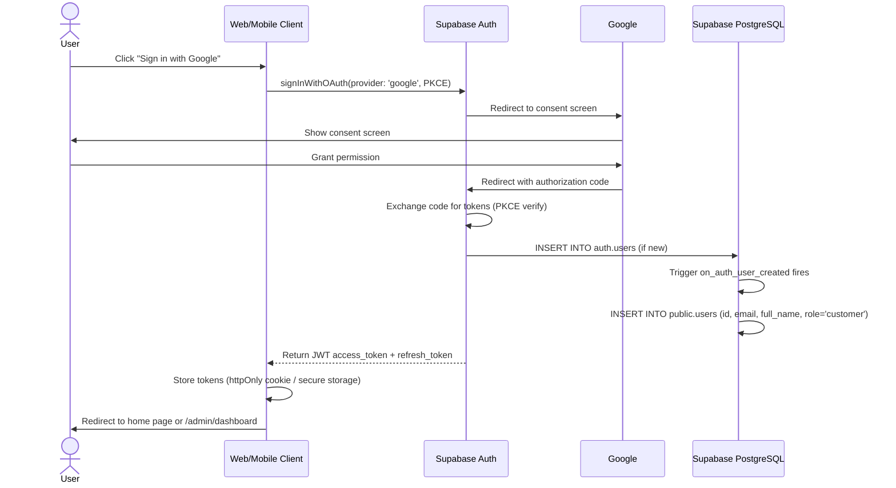
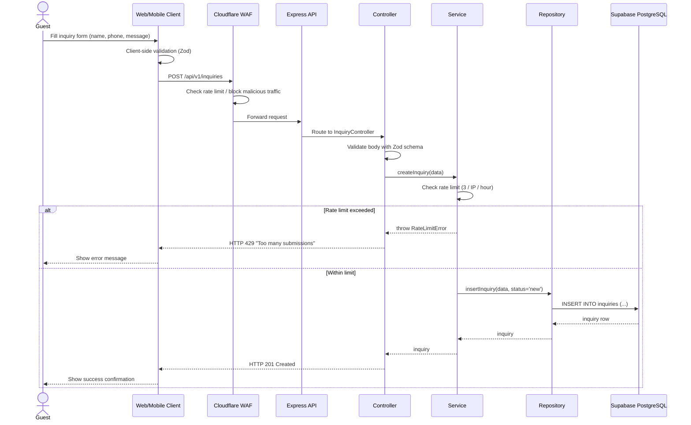
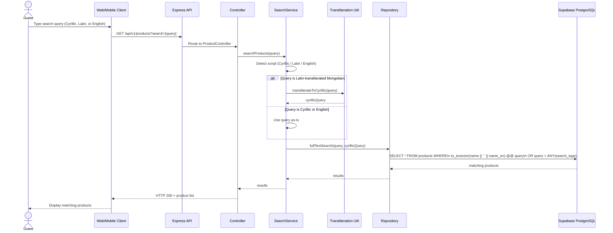
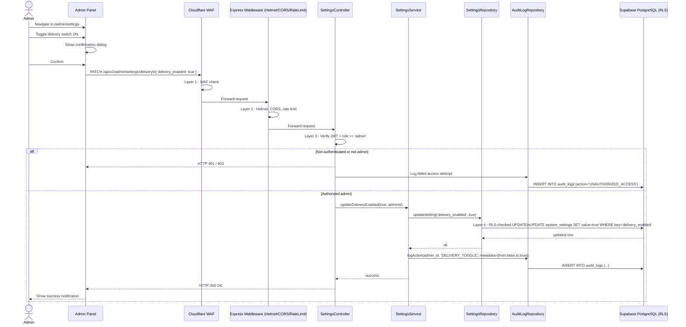
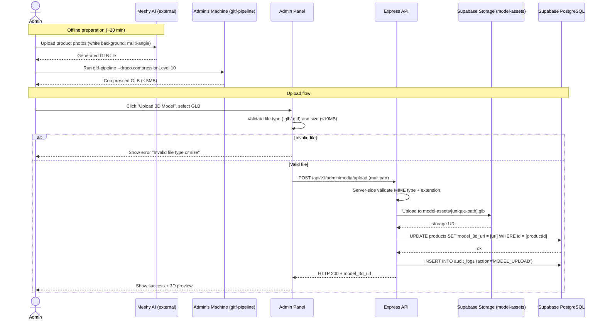
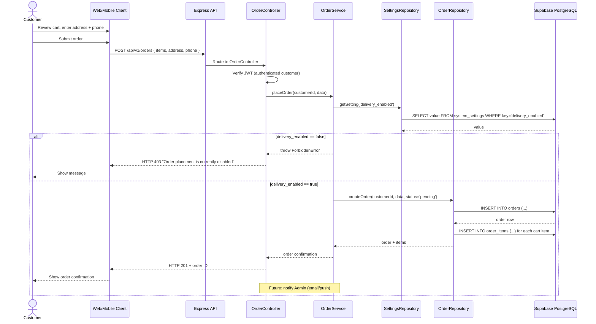

# Дараалал (Sequence) Диаграмууд

**Баримт бичиг:** `docs/05-sequence-diagrams.mn.md`  
**Төсөл:** Ногоолин — Шашны Бүтээгдэхүүний Каталог Платформ  
**Хувилбар:** 1.0.0  
**Төлөв:** Ноорог  
**Зохиогч:** Тэнгис (Хөгжүүлэгч)  
**Сүүлд шинэчилсэн:** 2026 оны 6-р сар  
**Хамааралтай баримт:** [`docs/03-use-cases.mn.md`](./03-use-cases.mn.md), [`docs/04-er-diagram.mn.md`](./04-er-diagram.mn.md)

---

## Өөрчлөлтийн Түүх

| Хувилбар | Огноо | Төрөл | Тайлбар |
|---|---|---|---|
| 1.0.0 | 2026 оны 6-р сар | MAJOR | Анхны хувилбар. Auth, хүсэлт, олон бичгийн системийн хайлт (FR-PUB-014, v1.2.0), хүргэлтийн товч, 3D загвар байршуулалт, ирээдүйн захиалга хийх урсгалыг хамарсан 6 sequence диаграм. |

---

## Гарчгийн Жагсаалт

1. [Тойм](#1-тойм)
2. [SEQ-001: Google OAuth-аар Нэвтрэх](#2-seq-001-google-oauth-аар-нэвтрэх)
3. [SEQ-002: Бүтээгдэхүүний Хүсэлт Илгээх](#3-seq-002-бүтээгдэхүүний-хүсэлт-илгээх)
4. [SEQ-003: Олон Бичгийн Системийн Хайлт](#4-seq-003-олон-бичгийн-системийн-хайлт)
5. [SEQ-004: Администратор Хүргэлтийн Тохиргоог Сэлгэх](#5-seq-004-администратор-хүргэлтийн-тохиргоог-сэлгэх)
6. [SEQ-005: 3D Загвар (GLB) Байршуулах](#6-seq-005-3d-загвар-glb-байршуулах)
7. [SEQ-006: Захиалга Хийх (Ирээдүй)](#7-seq-006-захиалга-хийх-ирээдүй)

---

## 1. Тойм

Энэхүү баримт бичиг нь системийн бүрэлдэхүүн хэсгүүдийн хоорондын ажиллах үеийн (runtime) харилцан үйлчлэлийн урсгалыг харуулна: client (вэб/мобайл), Cloudflare, Express API (Controller → Service → Repository), Supabase Auth, Supabase PostgreSQL (RLS-тэй), Supabase Storage.

Диаграм бүр [`docs/03-use-cases.mn.md`](./03-use-cases.mn.md)-ийн холбогдох хэрэглэх тохиолдол болон [`docs/02-requirements.mn.md`](./02-requirements.mn.md)-ийн шаардлагыг лавлана.

**Бүх диаграмд ашиглагдах давхаргын тэмдэглэгээ:**

```
Client → Cloudflare (WAF) → Express API (Controller → Service → Repository) → Supabase
```

---

## 2. SEQ-001: Google OAuth-аар Нэвтрэх

**Лавлагаа:** UC-A-002, FR-AUTH-002, FR-AUTH-004, FR-AUTH-010



**Тэмдэглэл:**
- Администратор хэрэглэгчдийн хувьд `role`-ыг үүсгэсний дараа гараар `admin` болгож тохируулна (OAuth-ийн анхдагч утга биш).
- Мобайл (Flutter) нь WebView ашиглахгүйгээр native `signInWithIdToken` ашиглана (FR-AUTH-002) — мэдээллийн сангийн trigger логик ижил хэвээр байна.

---

## 3. SEQ-002: Бүтээгдэхүүний Хүсэлт Илгээх

**Лавлагаа:** UC-G-007, FR-INQ-001 - FR-INQ-007



---

## 4. SEQ-003: Олон Бичгийн Системийн Хайлт

**Лавлагаа:** FR-PUB-013, FR-PUB-014 (v1.2.0)



**Тэмдэглэл:**
- `search_tags` (text[]) нь урьдчилан бэлдсэн латин транслитерац болон ойролцоо нэрсийг хадгална (жишээ: `['nogoon dar eh', 'green tara', 'tara statue']`), администратор удирдана (FR-PUB-015).
- Transliteration util нь гадаад API дуудалт шаардахгүй цэвэр функц — хайлтын хариу хугацаа бага байлгана (NFR-PERF-004).

---

## 5. SEQ-004: Администратор Хүргэлтийн Тохиргоог Сэлгэх

**Лавлагаа:** UC-ADM-011, UC-SYS-002, UC-SYS-003, FR-SET-001 - FR-SET-007, FR-AUD-005



**Тэмдэглэл:**
- Энэ зөвхөн админд зориулсан mutation дээр аюулгүй байдлын бүх 4 давхарга (Cloudflare WAF → Helmet/CORS/RateLimit → JWT/RBAC → Supabase RLS) шалгагдана.
- Аудит бүртгэлийн мөр нь үндсэн үйлдэл амжилттай болсны **дараа** бичигдэнэ (UC-SYS-003), мөн зөвхөн нэмэлт (append-only, FR-AUD-003).

---

## 6. SEQ-005: 3D Загвар (GLB) Байршуулах

**Лавлагаа:** UC-ADM-006, FR-MEDIA-007 - FR-MEDIA-011



---

## 7. SEQ-006: Захиалга Хийх (Ирээдүй)

**Лавлагаа:** UC-F-001, FR-ORD-001 - FR-ORD-008, FR-SET-004 — **W priority, `delivery_enabled`-аар хязгаарлагдана**



---

*Өмнөх баримт бичиг: [`docs/04-er-diagram.mn.md`](./04-er-diagram.mn.md)*  
*Дараагийн баримт бичиг: [`docs/06-api-spec.yaml`](./06-api-spec.yaml)*