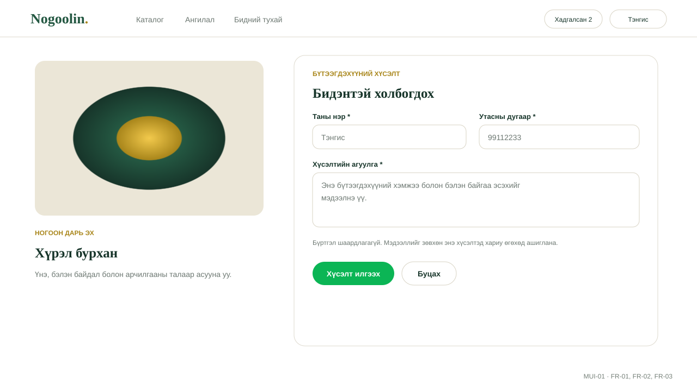
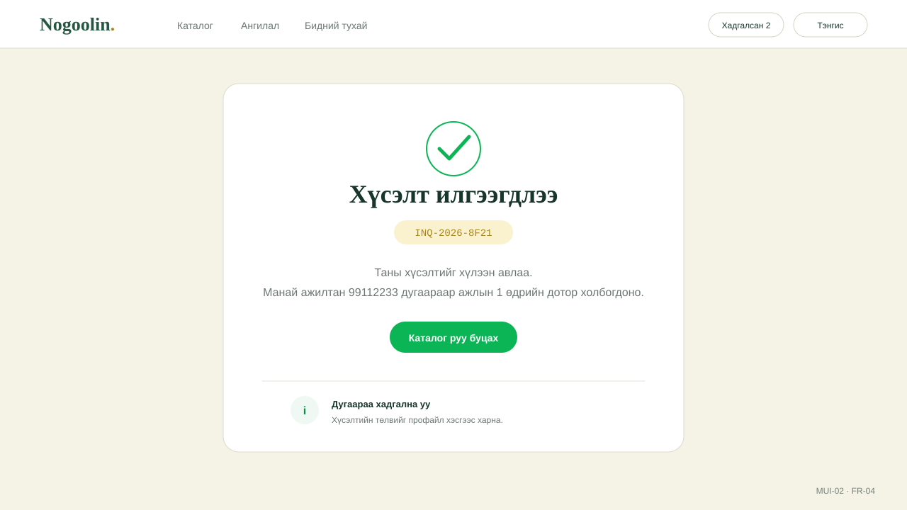
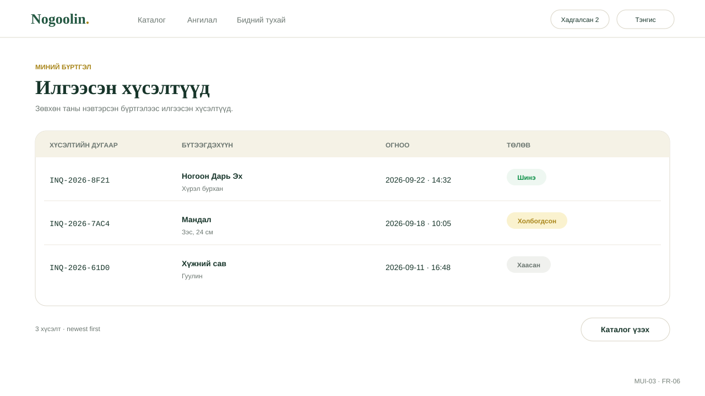
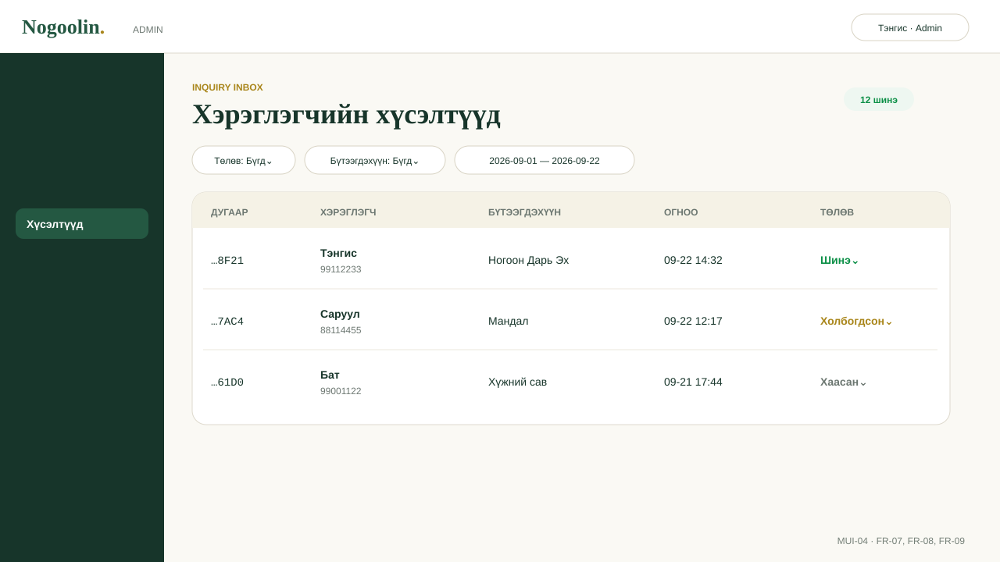
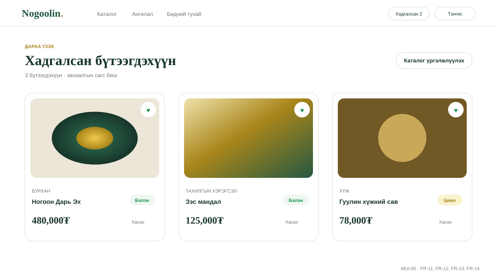

\input{sem3-title.tex}

# Nogoolin Software Requirements Specification

**ICSI438 · Seminar 3 / M3 · Тэнгис · v1.0 draft · 2026-09-22**

## Баримтын төлөв

Энэ хувилбар нь M3-д зориулсан бүрэн агуулгатай draft. Нийт 15 функциональ, 5 функциональ бус шаардлагатай. Peer review болон trial test execution хийгдээгүй; доорх test procedure-ууд нь төлөвлөсөн шалгалт бөгөөд pass болсон нотолгоо биш. Эх кодын хэрэгжилтийн төлөвийг шаардлагын статусад тусад нь тэмдэглэв.

| Талбар | Утга |
|---|---|
| Төсөл | Nogoolin |
| Зохиогч, owner | Тэнгис |
| Хувилбар | v1.0 draft |
| Үндсэн уншигч | Хөгжүүлэгч Тэнгис |
| Хоёрдогч уншигч | ICSI438 хичээлийн багш |
| Public repository | <https://github.com/Tengis01/Nogoolin> |
| Review | Хийгдээгүй; бодит peer comment байхгүй |
| Trial test | Хийгдээгүй; procedure ба pass/fail босго төлөвлөсөн |

## 1. Оршил

### 1.1 Зорилго

Энэ SRS нь Nogoolin-ийн каталогийн inquiry, wishlist болон нүүрний hero fallback урсгалын ажиглагдах зан төлөвийг хэрэгжүүлэлт, шалгалтын гэрээ болгон тодорхойлно. Шаардлага бүр хамгийн чухал үр дүнгээр эхэлж, ID, эх, priority, owner, verification болон pass/fail босготой байна.

### 1.2 Хамрах хүрээ

Хүрээг [SRS Scope Charter](scope-charter.md)-аар тогтоов. Энэ хувилбарт:

- зочин болон нэвтэрсэн хэрэглэгчийн бүтээгдэхүүний inquiry;
- өөрийн inquiry history;
- админы inquiry inbox, filter, status;
- нэвтэрсэн хэрэглэгчийн wishlist;
- asset болон хөдөлгөөний тохиргооноос үл хамааран каталогт хүрэх hero fallback;
- өгөгдлийн тусгаарлалт, гүйцэтгэл, accessibility, retry reliability, deploy gate орно.

Захиалга, төлбөр, хүргэлт, production cloud, mobile inquiry/wishlist, бүтээгдэхүүн бүрийн 360° viewer энэ SRS-ийн хүрээнээс гадуур.

### 1.3 Нэр томьёо

| Нэр | Тайлбар |
|---|---|
| Inquiry | Бүтээгдэхүүний тухай нэр, утас, зурвасаар илгээсэн хүсэлт |
| Wishlist | Нэвтэрсэн хэрэглэгчийн дараа үзэхээр хадгалсан бүтээгдэхүүний жагсаалт; checkout биш |
| Guest | Нэвтрээгүй каталогийн хэрэглэгч |
| Customer | Нэвтэрсэн хэрэглэгч |
| Admin | Inquiry-г харах, төлөв солих эрхтэй хэрэглэгч |
| FR / NFR | Функциональ / функциональ бус шаардлага |
| Priority | `must`, `should`, `could` гэсэн M3-ийн MoSCoW тэмдэглэгээ |
| Planned test | Procedure бичигдсэн боловч энэ ажлаар ажиллуулаагүй шалгалт |

### 1.4 Эх сурвалж

- [Phase 0 requirements](../phase-0/02-requirements.md), [security](../phase-0/08-security.md), [wireframes](../phase-0/07-uiux-wireframes.md), [roadmap](../phase-0/10-roadmap.md)
- Одоогийн inquiry, wishlist, hero, auth болон admin эх код
- ICSI438 Lecture 03, Week 03 handout
- Bhatti et al., *Docs for Developers*, бүлэг 3, х. 58–59
- Chinchilla, *Technical Writing for Software Developers*, бүлэг 5 ба 9
- [Akamai retail performance report](https://www.ir.akamai.com/news-releases/news-release-details/akamai-online-retail-performance-report-milliseconds-are)
- [Stripe idempotent requests](https://docs.stripe.com/api/idempotent_requests)

### 1.5 Баримтын бүтэц

§2 нь бүтээгдэхүүний орчин, хэрэглэгч, хязгаарлалтыг; §3 нь интерфэйсийг; §4 нь 15 FR-ийг; §5 нь 5 NFR-ийг тодорхойлно. Чанарын checklist болон 20 мөртэй traceability нь төгсгөлийн хавсралтад байна.

## 2. Ерөнхий тодорхойлолт

### 2.1 Бүтээгдэхүүний орчин

Nogoolin нь Next.js web, Fastify REST API, Supabase PostgreSQL/Auth/Storage бүхий шашин, зан үйлийн бүтээгдэхүүний каталог. Web болон mobile нь нэг `/api/v1/` REST API хэрэглэнэ. Энэ SRS-ийн урсгал web интерфэйс болон API дээр төвлөрнө.

### 2.2 Гол үйлдлүүд

Хэрэглэгч бүтээгдэхүүнээс inquiry илгээж баталгааны дугаар авна. Нэвтэрсэн хэрэглэгч өөрийн inquiry history болон wishlist-ийг харна. Админ inquiry жагсаалтыг шүүж, төлөвийг шинэчилнэ. Hero ажиллах боломжгүй нөхцөлд статик хувилбар каталогийн холбоосыг хадгална.

### 2.3 Хэрэглэгчийн онцлог

- **Guest:** бүртгэлгүйгээр каталог үзэж inquiry илгээнэ.
- **Customer:** өөрийн inquiry history болон wishlist-д хандана.
- **Admin:** хүсэлтүүдийг эрэмбэлж, шүүж, төлөв шинэчилнэ.
- **Developer:** local орчинд API, web, auth болон өгөгдлийн урсгалыг шалгана.

Persona-ийн эх нь [Week 2 нэмэлт](../ICSI438/sem2/wiki/persona-and-pivot.md). Шинэ stakeholder interview хийгдээгүй.

### 2.4 Хязгаарлалт

- Ганцаар хөгжүүлж байгаа тул M3 нь Scope Charter-ийн урсгалаар хязгаарлагдана.
- Монгол интерфэйсийн үндсэн алдааны мессежийг хадгална.
- `delivery_enabled=false`; wishlist нь захиалга, үнэ бодох, checkout хийхгүй.
- Cloud болон бодит 3D asset бэлэн гэж таамаглахгүй.
- Нууц түлхүүр client bundle болон repository-д орохгүй.

### 2.5 Таамаг ба хамаарал

Шалгалтын үед Node 20+, pnpm, Docker, local Supabase болон seed бүтээгдэхүүн бэлэн байна гэж үзнэ. Хэрэв local DB байхгүй бол integration test-ийн үр дүнг pass гэж тооцохгүй. Authenticated тестэд customer болон admin test account шаардана.

## 3. Гадаад интерфэйс

### 3.1 Хэрэглэгчийн интерфэйс

Inquiry form нь нэр, 8 оронтой утас, зурвас, илгээх болон буцах үйлдэлтэй. Success төлөв нь inquiry дугаар, холбоо барих утас, каталог руу буцах холбоос харуулна. Wishlist нь хадгалсан бүтээгдэхүүний карт эсвэл empty state харуулна. Admin inbox нь status/product/date filter болон status update үйлдэлтэй.

### 3.2 Программын интерфэйс

| Интерфэйс | Гол үр дүн |
|---|---|
| `POST /api/v1/inquiries` | `201 {data}` эсвэл validation/not-found/rate-limit алдаа |
| `GET /api/v1/inquiries/mine` | Нэвтэрсэн хэрэглэгчийн өөрийн inquiry жагсаалт |
| `GET /api/v1/admin/inquiries` | Шүүсэн, хуудасласан inquiry жагсаалт |
| `PATCH /api/v1/admin/inquiries/{id}/status` | Шинэ төлөвтэй inquiry |
| `GET /api/v1/cart` | Хэрэглэгчийн wishlist |
| `POST /api/v1/cart` | Нийтлэгдсэн бүтээгдэхүүнийг хадгалж `201` |
| `DELETE /api/v1/cart/{productId}` | Хадгалсан бүтээгдэхүүнийг хасаад `204` |

### 3.3 Харилцаа ба өгөгдлийн формат

REST хүсэлт, хариу JSON форматтай. Огноо ISO 8601 UTC байна. Production орчинд HTTPS хэрэглэнэ. Нэвтэрсэн урсгал Bearer access token ашиглаж, хэрэглэгчийн ID-г body/query-гээс биш баталгаажсан token-оос авна.

### 3.4 Төхөөрөмжийн интерфэйс

Тусгай төхөөрөмж, сенсор, hardware port хэрэглэхгүй. Web интерфэйс mouse, touch болон keyboard оролтыг дэмжинэ.

## 4. Функциональ шаардлага

### FR-01 — Зочны inquiry үүсгэх

**Requirement · must.** Зочин нийтлэгдсэн бүтээгдэхүүний inquiry form-д хүчинтэй нэр, утас, зурвас оруулж илгээхэд систем яг нэг inquiry үүсгэж, `201`, давтагдашгүй ID, `status=new`, `customer_id=null` буцаана.

**Source / owner:** FR-INQ-001…003, inquiry controller/schema · Тэнгис. **Verification T-01:** нийтлэгдсэн бүтээгдэхүүн дээр guest хүсэлт илгээж status, ID, DB-ийн нэг мөр, null customer-ийг шалгана. Аль нэг нь зөрвөл fail. **Mock UI:** [MUI-01](../assets/01-inquiry-form.png). **Status:** Implemented; test execution not performed.

### FR-02 — Нэвтэрсэн хэрэглэгчийн inquiry-г холбох

**Requirement · must.** Нэвтэрсэн хэрэглэгч inquiry илгээхэд систем хэрэглэгчийн баталгаажсан session ID-г `customer_id` болгон хадгалж, client body дахь owner утгыг үл хэрэгсэнэ.

**Source / owner:** migration 0007, optionalAuth, inquiry service · Тэнгис. **Verification T-02:** A customer-ийн token-оор илгээж, хадгалсан `customer_id=A`; body-д B ID оруулах боломжгүй/үл хэрэгссэн байхыг шалгана. **Mock UI:** [MUI-01](../assets/01-inquiry-form.png). **Status:** Implemented; not executed.

### FR-03 — Inquiry form-ийг баталгаажуулах

**Requirement · must.** Нэр 2-оос цөөн тэмдэгт, утас 8 цифр биш, зурвас хоосон эсвэл product ID буруу үед web систем тухайн талбарын монгол алдааг үзүүлж, API inquiry мөр үүсгэхгүй.

**Source / owner:** inquiry-form-schema, shared inquiryInputSchema, WF-INQ-01 · Тэнгис. **Verification T-03:** дөрвөн invalid input-ыг тус тус илгээж, field error/HTTP 400 эсвэл 404 болон DB row count өөрчлөгдөөгүйг шалгана. **Mock UI:** [MUI-01](../assets/01-inquiry-form.png). **Status:** Implemented; not executed.

### FR-04 — Inquiry баталгааг харуулах

**Requirement · must.** Inquiry амжилттай хадгалагдмагц web form-ийг success төлөвөөр сольж, форматласан inquiry дугаар, хэрэглэгчийн утас болон каталог руу буцах холбоос харуулна.

**Source / owner:** WF-INQ-04, `InquirySuccess`, inquiry-display · Тэнгис. **Verification T-04:** successful API response өгч, form алга болсон, дугаар/утас/link харагдсан, link `/products` нээснийг шалгана. **Mock UI:** [MUI-02](../assets/02-inquiry-success.png). **Status:** Implemented; not executed.

### FR-05 — Inquiry rate limit хэрэгжүүлэх

**Requirement · must.** Нэг IP нэг цагт тохируулсан дээд хэмжээнээс олон inquiry илгээвэл API шинэ мөр үүсгэхгүй, `429` буцааж, web нэг цагийн дараа дахин оролдох монгол тайлбар үзүүлнэ.

**Source / owner:** FR-INQ-007, NFR-SEC-002, rate-limit plugin · Тэнгис. **Verification T-05:** test max=1 үед эхний valid хүсэлт `201`, хоёр дахь нь `429`, DB-д нэг мөр байгааг шалгана. **Status:** Implemented; not executed.

### FR-06 — Өөрийн inquiry history-г харах

**Requirement · must.** Нэвтэрсэн customer өөрийн profile-оос зөвхөн өөрийн inquiry-г newest-first дарааллаар дугаар, бүтээгдэхүүн, огноо, төлөвтэй харна; guest `401` авна.

**Source / owner:** `/inquiries/mine`, inquiry repository, profile UI · Тэнгис. **Verification T-06:** A/B хэрэглэгч тус бүр мөртэй үед A response-д зөвхөн A ID орсон, guest `401`, UI зөв талбаруудтайг шалгана. **Mock UI:** [MUI-03](../assets/03-inquiry-history.png). **Status:** Implemented; not executed.

### FR-07 — Админ inquiry inbox харах

**Requirement · must.** Баталгаажсан admin inquiry жагсаалтыг newest-first, page/limit metadata-тай харна; guest `401`, энгийн customer `403` авна.

**Source / owner:** FR-INQ-004, FR-ADM-006, admin controller/table · Тэнгис. **Verification T-07:** хоёр өөр огноотой мөр үүсгээд дараалал, metadata, 401/403-г шалгана. **Mock UI:** [MUI-04](../assets/04-admin-inbox.png). **Status:** Implemented; not executed.

### FR-08 — Админ inquiry шүүх

**Requirement · should.** Admin inquiry inbox-ийг status, product ID болон date range-аар шүүхэд систем зөвхөн бүх идэвхтэй нөхцөлийг хангасан мөрүүдийг буцаана.

**Source / owner:** FR-INQ-006, adminInquiryListQuerySchema · Тэнгис. **Verification T-08:** new/contacted, хоёр product, хоёр огнооны fixture дээр filter бүр болон хослолын ID-г шалгана. **Mock UI:** [MUI-04](../assets/04-admin-inbox.png). **Status:** Implemented; not executed.

### FR-09 — Inquiry төлөв шинэчлэх

**Requirement · must.** Admin inquiry төлөвийг `new`, `contacted`, `closed` утгын аль нэгээр шинэчлэхэд API шинэ төлөвтэй мөрийг буцааж, audit log-д admin, entity ID, action, status-ийг нэмнэ.

**Source / owner:** FR-INQ-005, inquiryStatusPatchSchema, audit log repository · Тэнгис. **Verification T-09:** valid transition бүр `200` ба audit row үүсгэсэн; invalid status `400`, unknown ID `404`, customer `403` болохыг шалгана. **Mock UI:** [MUI-04](../assets/04-admin-inbox.png). **Status:** Implemented; not executed.

### FR-10 — Wishlist-д нэвтрэлт шаардах

**Requirement · must.** Guest `/wishlist` нээхэд web `/login?next=/wishlist` рүү шилжүүлж, wishlist API-ийн GET/POST/DELETE хүсэлт бүр `401` буцаана.

**Source / owner:** wishlist page, authenticated API scope · Тэнгис. **Verification T-10:** cookie/token-гүй page ба гурван endpoint-ийг шалгана. Redirect query болон бүх API status зөв байвал pass. **Status:** Implemented; not executed.

### FR-11 — Нийтлэгдсэн бүтээгдэхүүн хадгалах

**Requirement · must.** Нэвтэрсэн хэрэглэгч нийтлэгдсэн бүтээгдэхүүний хадгалах товчийг дарахад систем тухайн хэрэглэгчийн wishlist-д бүтээгдэхүүнийг нэмээд `201` буцаана; draft, archived эсвэл unknown product-д `404` буцаана.

**Source / owner:** cart service/controller, SaveButton · Тэнгис.

**Verification T-11:** published, draft, unknown fixture дээр POST response ба DB мөрийг шалгана. **Mock UI:** [MUI-05](../assets/05-wishlist.png). **Status:** Implemented; not executed.

### FR-12 — Wishlist давхардлыг хориглох

**Requirement · must.** Нэг хэрэглэгч нэг бүтээгдэхүүнийг давтан хадгалахад систем хамгийн ихдээ нэг `(user_id, product_id)` мөр хадгалж, wishlist-д нэг карт харуулна.

**Source / owner:** cart repository, unique migration constraint · Тэнгис. **Verification T-12:** ижил POST-ыг хоёр удаа явуулж, хоёул амжилттай боловч DB/list count=1 байхыг шалгана. **Mock UI:** [MUI-05](../assets/05-wishlist.png). **Status:** Implemented; not executed.

### FR-13 — Wishlist жагсаах

**Requirement · must.** Нэвтэрсэн хэрэглэгч wishlist-ээ нээхэд систем зөвхөн өөрийн хадгалсан бүтээгдэхүүнийг newest-first дарааллаар нэр, зураг, үнэ, stock status-тай харуулна; хоосон үед каталогийн холбоостой empty state үзүүлнэ.

**Source / owner:** cart repository, WishlistGrid · Тэнгис. **Verification T-13:** A/B хэрэглэгчийн fixture, хоёр огноо болон empty account ашиглан ownership, order, fields, empty link-ийг шалгана. **Mock UI:** [MUI-05](../assets/05-wishlist.png). **Status:** Implemented; not executed.

### FR-14 — Wishlist-ээс хасах

**Requirement · must.** Нэвтэрсэн хэрэглэгч хадгалсан бүтээгдэхүүнийг хасахад API `204` буцааж, UI картаа арилгана; ижил DELETE-г дахин хийхэд мөн `204` буцааж бусдын мөрийг өөрчлөхгүй.

**Source / owner:** cart remove service/repository, wishlist store · Тэнгис. **Verification T-14:** A/B хэрэглэгч ижил product хадгалсан үед A хоёр удаа DELETE хийж, A-д 0, B-д 1 мөр үлдсэнийг шалгана. **Mock UI:** [MUI-05](../assets/05-wishlist.png). **Status:** Implemented; not executed.

### FR-15 — Hero fallback-аас каталогт хүрэх

**Requirement · must.** 3D asset тохируулаагүй эсвэл WebGL боломжгүй үед web canvas-гүй статик hero харуулж, хэрэглэгчид ажиллах `/products` холбоос өгнө.

**Source / owner:** WF-INTRO-03/07, static-hero, intro-config · Тэнгис. **Verification T-15:** asset URL байхгүй ба WebGL disabled хоёр нөхцөлд static hero, link, scroll lock байхгүйг desktop/mobile дээр шалгана. **Status:** Implemented for missing configuration/WebGL; broken asset recovery is a known gap; not executed.

## 5. Функциональ бус шаардлага

### NFR-01 — Хувийн өгөгдлийг тусгаарлах

**Requirement · Security · must.** Customer A-ийн wishlist болон inquiry history response-д customer B-ийн ID эсвэл мөр огт орохгүй; customer admin endpoint-д `403`, guest хамгаалагдсан endpoint-д `401` авна.

**Source / owner:** security §9, P-NG-01, auth hooks, ownership repositories · Тэнгис. **Verification I-01/T-16:** controller→service→repository→RLS замыг inspect хийж, A/B/admin runtime matrix ажиллуулна. Нэг cross-user мөр илэрвэл fail. **Status:** Static path partially inspected; runtime not executed.

### NFR-02 — Хөдөлгөөн багасгах тохиргоо

**Requirement · Accessibility/Reliability · must.** `prefers-reduced-motion: reduce` идэвхтэй үед web хөдөлгөөнт 3D intro-г эхлүүлэхгүй, статик hero болон каталогийн холбоосыг 1 секундийн дотор харуулна.

**Source / owner:** NFR-ACC-004, WF-INTRO-06/07, hero-intro · Тэнгис. **Verification T-17:** browser media emulation-аар reduce/no-preference нөхцөлийг харьцуулж, canvas байхгүй, CTA хугацаа ≤1 s болохыг хэмжинэ. **Status:** Implemented; not executed.

### NFR-03 — Deploy-оос өмнөх тестийн хаалт

**Requirement · Maintainability · must.** API production deploy нь integration test үнэхээр ажиллаж амжилттай болсон, production Docker build амжилттай болсон үед л eligible байна; test fail, all-skipped эсвэл build fail бүр deploy-г хаана.

**Source / owner:** NFR-MAIN-005/006, API workflow, test skip branch · Тэнгис. **Verification I-02:** CI dependency ба гурван negative log-ийг шалгана. **Status:** Gap/planned W9; local DB provisioning байхгүй тул all-skipped хаалт одоогоор хангагдаагүй.

### NFR-04 — Каталогийн хуудсын ачааллын хугацаа

**Requirement · Performance · must.** Нийтлэгдсэн бүтээгдэхүүнтэй `/products` хуудас cold-cache simulated 4G, mid-tier mobile profile дээр 10 хэмжилтийн дор хаяж 9-д нь 2.0 секундээс өмнө үндсэн каталогийн агуулгаа харуулна.

**Source / owner:** NFR-PERF-002; Akamai-ийн retail performance report нь 2 секундийн саатал bounce rate-ийг өсгөдөг болохыг тайлагнасан · Тэнгис. **Verification A-01/T-18:** Lighthouse эсвэл browser trace-аар ижил build/seed/profile дээр 10 run хийж, 9/10 ≤2.0 s бол pass. **Status:** Requirement defined; not executed.

### NFR-05 — Inquiry retry давхардал үүсгэхгүй байх

**Requirement · Reliability · should.** Client `Idempotency-Key`-тай ижил inquiry POST-ыг ижил payload-аар 24 цагийн дотор давтахад систем эхний status/body-г буцааж, inquiry мөрийг нэгээс олшруулахгүй; ижил key өөр payload-тай бол `409` буцаана.

**Source / owner:** давтагдсан илгээлтийн эрсдэл; Stripe idempotent request нь retry-г давхар object үүсгэхгүй болгох, key-г дор хаяж 24 цаг хадгалах жишиг өгдөг · Тэнгис. **Verification T-19:** нэг key/ижил payload хоёр POST → нэг row, ижил ID; нэг key/өөр payload → `409`; 24 цагийн хадгалалтыг clock-controlled test-ээр шалгана. **Status:** Planned; одоогийн API энэ header-ийг хэрэгжүүлээгүй.

## 6. Бусад шаардлага

Inquiry phone нь зөвхөн хариу өгөх зорилгоор хэрэглэгдэнэ. Secret болон service-role key нь server-side орчинд хадгалагдана. Admin status update бүр audit log үүсгэнэ. Монгол интерфэйсийн алдааны мессежийг code/API нэрээс бусад хэсэгт хэрэглэнэ.

## 7. Verification төлөв

Энэ M3 багцаар test procedure болон хэмжигдэх босго бичсэн. Үндсэн хэрэгжилтийн хугацаанаас шалтгаалан 80% trial test ажиллуулаагүй. Иймд ямар ч шаардлагыг энэ баримтаар `verified` гэж зарлаагүй; `implemented` нь зөвхөн кодын зам байгаа гэсэн утгатай.

## Хавсралт A. ISO/IEEE чанарын checklist

| Шалгуур | M3 хяналт |
|---|---|
| Correct | Эх код, Phase 0, Scope Charter-тай тулгасан; stakeholder interview байхгүйг тэмдэглэсэн |
| Unambiguous | Нэг ID нэг ажиглагдах үндсэн үр дүнтэй; тодорхой role, нөхцөл, status ашигласан |
| Complete | 15 FR + 5 NFR, интерфэйс, dependency, error/boundary болон verification орсон |
| Consistent | Wishlist-ийг checkout гэж нэрлээгүй; delivery disabled, scope exclusion-тай зөрчөөгүй |
| Ranked | Week 3-ын `must/should/could` priority бүх шаардлагад бий |
| Verifiable | Шаардлага бүр named procedure болон pass/fail босготой |
| Modifiable | FR/NFR ID тогтвортой, requirement ба traceability тусдаа эхтэй |
| Traceable | [20 мөртэй matrix](traceability-matrix-v1.0.md)-аар source→requirement→verification холбоно |

## Хавсралт B. Шаардлагын тоо

| Төрөл | Must | Should | Could | Нийт |
|---|---:|---:|---:|---:|
| FR | 14 | 1 | 0 | 15 |
| NFR | 4 | 1 | 0 | 5 |
| **Нийт** | **18** | **2** | **0** | **20** |

\newpage

# Traceability Matrix — SRS v1.0 draft

**Nogoolin · ICSI438 M3 · Тэнгис · 2026-09-22**

Нийт 20 шаардлага, 20 мөр, 8 баганатай. `Planned` verification нь procedure бичигдсэн боловч энэ ажлаар ажиллуулаагүй гэсэн утгатай. Peer review болон stakeholder interview хийгдээгүй.

\begingroup\footnotesize\setlength{\tabcolsep}{2pt}

| ID | Source | Owner | Verification | Dependency | Risk | Status | Last-Reviewed |
|---|---|---|---|---|---|---|---|
| FR-01 | FR-INQ-001…003; controller/schema | Тэнгис | T-01 guest create | Product, DB | Давхар мөр | Implemented; planned test | 2026-09-22 |
| FR-02 | migration 0007; optionalAuth | Тэнгис | T-02 session link | Auth | Client owner spoof | Implemented; planned test | 2026-09-22 |
| FR-03 | form/shared schemas; WF-INQ-01 | Тэнгис | T-03 invalid matrix | Zod, UI | Web/API drift | Implemented; planned test | 2026-09-22 |
| FR-04 | WF-INQ-04; InquirySuccess | Тэнгис | T-04 success UI | Create response | Баталгаа ойлгомжгүй | Implemented; planned test | 2026-09-22 |
| FR-05 | FR-INQ-007; rate-limit plugin | Тэнгис | T-05 cap+1 | IP detection | Spam / shared IP | Implemented; planned test | 2026-09-22 |
| FR-06 | inquiries mine; P-NG-01 | Тэнгис | T-06 A/B/guest | Auth, ownership | Cross-user leak | Implemented; planned test | 2026-09-22 |
| FR-07 | FR-INQ-004; admin inbox | Тэнгис | T-07 order/RBAC | Admin role | Unauthorized inbox | Implemented; planned test | 2026-09-22 |
| FR-08 | FR-INQ-006; query schema | Тэнгис | T-08 filter matrix | Seed variety | Буруу result set | Implemented; planned test | 2026-09-22 |
| FR-09 | FR-INQ-005; audit repository | Тэнгис | T-09 status/audit | Admin, audit | Төлөв audit-гүй | Implemented; planned test | 2026-09-22 |
| FR-10 | wishlist page; auth scope | Тэнгис | T-10 redirect/401 | Auth middleware | Guest data access | Implemented; planned test | 2026-09-22 |
| FR-11 | cart service; SaveButton | Тэнгис | T-11 product states | Published product | Draft exposure | Implemented; planned test | 2026-09-22 |
| FR-12 | cart repository; unique pair | Тэнгис | T-12 repeated POST | DB constraint | Duplicate cards | Implemented; planned test | 2026-09-22 |
| FR-13 | cart list; WishlistGrid | Тэнгис | T-13 owner, order, empty | Product join | Null/stale product | Implemented; planned test | 2026-09-22 |
| FR-14 | cart remove; wishlist store | Тэнгис | T-14 repeated DELETE | Ownership | Бусдын мөр устах | Implemented; planned test | 2026-09-22 |
| FR-15 | WF-INTRO-03/07; static hero | Тэнгис | T-15 fallback paths | Intro config | Blank/locked page | Partial; planned test | 2026-09-22 |
| NFR-01 | Security §9; P-NG-01 | Тэнгис | I-01/T-16 A/B matrix | JWT, RLS, RBAC | Personal data leak | Partial inspection | 2026-09-22 |
| NFR-02 | NFR-ACC-004; hero-intro | Тэнгис | T-17 reduce ≤1 s | Browser media query | Motion barrier | Implemented; planned test | 2026-09-22 |
| NFR-03 | NFR-MAIN-005/006; CI | Тэнгис | I-02 negative CI | Local DB, Docker | False-green deploy | Gap; planned W9 | 2026-09-22 |
| NFR-04 | NFR-PERF-002; Akamai | Тэнгис | A-01/T-18 9/10 ≤2 s | Seed, 4G profile | Slow catalog | Defined; not executed | 2026-09-22 |
| NFR-05 | Stripe idempotency; retry risk | Тэнгис | T-19 24 h retry | Key store/clock | Duplicate inquiry | Planned; not implemented | 2026-09-22 |

## W1 persona холбоо

W1 P1-ийн session оношлох хэрэгцээг P-NG-01-ээр дамжуулан FR-02, FR-06, FR-10, NFR-01-т холбоно. W1 P3-ийн local/pipeline ялгааг NFR-03-т холбоно. Энэ нь шинэ төсөлд хийсэн тайлбарласан mapping бөгөөд W1-д IDOR эсвэл CI gate байсан гэж өөрчлөөгүй.

## Change record

| Version | Өөрчлөлт | Review |
|---|---|---|
| M2 v0.2 | 2 FR + 3 NFR-ийн seed, 5 мөр | Self-check |
| M3 v1.0 draft | 15 FR + 5 NFR, 20 мөр, Week 3 priority | Source/code check |
| Peer-reviewed v1.0 | Үүсгээгүй | Бодит peer comment байхгүй |

\newpage

# Use–Verify–Cite: AI candidate ба эхээр шалгасан засвар

**Nogoolin · ICSI438 M3 · Тэнгис · 2026-09-22**

Энэ хүснэгтийн AI candidate нь requirement drafting-ийн эхний санал. Засварыг Scope Charter, Phase 0, одоогийн код болон хэмжигдэх шалгууртай тулгаж хийсэн. AI output-ыг дангаар нь specification гэж үзээгүй.

\begingroup\footnotesize\setlength{\tabcolsep}{2pt}\sloppy

| № | AI candidate | Илэрсэн зөрүү | Эхээр шалгасан засвар | Cite |
|---:|---|---|---|---|
| 1 | “The system should let users easily send product inquiries.” | `should`, “easily” хоёр нь хэмжигдэхгүй; guest/customer, input, output, status байхгүй. | **FR-01:** valid нэр, утас, зурваст яг нэг inquiry үүсгэж `201`, ID, `status=new`, guest-д `customer_id=null` буцаана. | inquiry controller, inquiry schema, FR-INQ-001…003 |
| 2 | “The wishlist may be available to both guests and registered users and should remember products.” | Одоогийн auth boundary-тай зөрсөн; wishlist-ийг checkout-той андуурах эрсдэлтэй; duplicate boundary байхгүй. | **FR-10–14:** guest redirect/401; зөвхөн customer-ийн жагсаалт; published product; unique user-product pair; idempotent remove. | `wishlist/page.tsx`, `cart.controller.ts`, `cart.repository.ts`, migration 0007 |
| 3 | “The app shall always display an impressive 3D hero and load quickly.” | Asset байхгүй нөхцөл, WebGL, reduced motion-ийг орхисон; “impressive”, “quickly” шалгах боломжгүй; хоёр чанарыг нэг өгүүлбэрт хольсон. | **FR-15:** missing asset/WebGL үед static hero + `/products`; **NFR-02:** reduced motion үед CTA ≤1 s; **NFR-04:** 10 run-ийн 9-д каталог ≤2.0 s. | WF-INTRO-03/06/07, `hero-intro.tsx`, `static-hero.tsx`, Akamai report |

\endgroup

## Use–Verify–Cite протокол

1. **Use:** AI-г эхний candidate болон эрсдэлийн асуулт гаргахад ашиглав.
2. **Verify:** Requirement бүрийг repository-ийн schema, controller, service, UI болон Phase 0 эхтэй тулгав.
3. **Cite:** Final шаардлагын Source болон traceability мөрд шалгасан файл, баримт, гаднын эхийг бичив.

## Дүгнэлт

AI candidate нь хурдан эхлэл өгсөн боловч гурван тохиолдолд хэмжигдэх босго, системийн хил, одоогийн auth/asset нөхцөлийг алдсан. Source-оор шалгасны дараа өгүүлбэрүүд pass/fail нөхцөлтэй болсон. Энэ хүснэгт нь AI өөрийгөө зөв гэж баталсан нотолгоо биш; хүлээлгэн өгөхийн өмнөх эцсийн утгын хяналтыг Тэнгис хийнэ.

\newpage

# UE-3 — Corg.ly requirement diff ба reflection

**ICSI438 Seminar 3 · Тэнгис · 2026-09-22**

## 1. “Most important information first” хэлбэрийн 5 FR

Эдгээр нь Bhatti-ийн Corg.ly Pet Translation API кейс дээр хийсэн дасгал. Тоон хязгааруудыг дасгалын testable contract болгохын тулд ил тод тогтоосон; Corg.ly-ийн бодит production contract гэж үзэхгүй.

### C-FR-01 — Audio upload

**Corg.ly valid dog-bark audio-г нэг upload ID-тай хүлээн авна.** Баталгаажсан client `POST /audio` руу MP3 эсвэл WAV, 20 MB хүртэл файл илгээхэд API `202`, `uploadId`, `status=queued` буцаана; формат эсвэл хэмжээ зөрвөл `400/413` буцаана.

### C-FR-02 — Authentication

**Corg.ly зөв API key-тэй хүсэлтийг л translation queue-д оруулна.** `Authorization: Bearer` header байхгүй эсвэл хүчингүй бол API `401` буцааж, upload/job үүсгэхгүй.

### C-FR-03 — Translation result

**Corg.ly дууссан job-д англи орчуулга болон confidence утга буцаана.** Client `GET /translations/{jobId}` дуудахад completed job нь `translation`, 0–1 хооронд `confidence`, `completedAt` бүхий `200` хариу өгнө.

### C-FR-04 — Processing status

**Corg.ly дуусаагүй job-ийн одоогийн төлөвийг алдалгүй мэдээлнэ.** Queued/processing job-д API `200`, зөвхөн `queued|processing` status болон retry хийх `pollAfterSeconds` утга буцааж, хоосон translation үүсгэхгүй.

### C-FR-05 — Safe retry

**Corg.ly ижил idempotency key-тэй давтан upload-аас нэг л job хадгална.** Ижил key, ижил файлтай хүсэлтийг 24 цагийн дотор давтахад анхны `uploadId` болон status-г буцаана; ижил key өөр файлтай бол `409` буцаана.

## 2. AI alternative ба зөрүү

| Human/source-first requirement | AI alternative | Concise/Usable зөрчил | Засварын шийдвэр |
|---|---|---|---|
| C-FR-01 | “Users should be able to upload various audio files of a reasonable size so that the innovative platform can process their beloved pets.” | Урт, сурталчилгааны үгтэй; format, size, response байхгүй. | Үр дүнг эхэнд тавьж MP3/WAV, 20 MB, `202/uploadId`, `400/413`-г нэрлэв. |
| C-FR-03 | “The system will try to provide a good translation to the user after processing has eventually completed.” | “try”, “good”, “eventually” нь pass/fail тогтоохгүй; output schema байхгүй. | `translation`, 0–1 confidence, `completedAt`, `200` гэсэн ажиглагдах үр дүн болгосон. |
| C-FR-05 | “The upload process should be robust and avoid unnecessary duplicates whenever possible.” | “robust”, “unnecessary”, “whenever possible” тодорхойгүй; retry identity ба хугацаа байхгүй. | Idempotency key, 24 цаг, ижил/өөр payload-ийн хариуг салгав. |

## 3. Requirement diff

| Шинж | AI draft | Зассан хувилбар |
|---|---|---|
| Эхлэл | Role/desire эсвэл ерөнхий тайлбар | Хэрэглэгчийн авах үр дүн |
| Үйл үг | should, try, avoid | accept, return, create, reject |
| Boundary | reasonable, eventually | 20 MB, 24 h, 0–1, HTTP status |
| Output | Ерөнхий success | Нэрлэсэн JSON field/status |
| Fail case | Байхгүй | `400`, `401`, `409`, `413` |

\newpage

## 4. Нэг хуудасны reflection

Bhatti-ийн “хамгийн чухал мэдээллийг эхэнд тавих” зарчмыг requirement дээр хэрэглэхэд өгүүлбэрийн эхний хэсэг л уншигчид юу авахыг ойлгуулах ёстойг анзаарлаа. Эхний AI хувилбарууд хэрэглэгчийн хүсэл, бүтээгдэхүүнийг магтсан үг, ерөнхий чанараар эхэлсэн. Тэдгээрийг уншихад яг ямар response гарах, ямар нөхцөлд fail болохыг дараа нь таах хэрэгтэй болсон. Харин зассан таван FR “Corg.ly юу буцаах вэ?” гэсэн үр дүнгээр эхэлж, дараа нь input ба boundary-г өгсөн.

Concise гэдэг нь зөвхөн цөөн үг хэрэглэх биш гэж ойлгов. Хэрэггүй үгийг хасахын зэрэгцээ шалгахад зайлшгүй хэрэгтэй format, хэмжээ, ID, status, хугацааг үлдээх шаардлагатай. Жишээлбэл “reasonable size” нь богино боловч usable биш; “MP3/WAV, 20 MB хүртэл” нь арай урт ч шалгаж болно. Мөн “good translation” гэсэн AI өгүүлбэрийг confidence field болон response schema-гаар сольсноор subjective үгийг ажиглагдах output болгосон.

Энэ дасгалын хамгийн том сургамж нь AI-ийн цэвэрхэн сонсогдох өгүүлбэрийг contract гэж шууд хүлээн авч болохгүй явдал байв. AI ихэвчлэн нөхцөл, алдааны хязгаар, хугацааг алгасаж, “should”, “robust”, “quickly” зэрэг аюулгүй мэт боловч шалгах боломжгүй үг хэрэглэсэн. Цаашид candidate бүр дээр input, action, observable output, failure boundary, verification гэсэн таван асуулт тавина. Ингэснээр requirement нь гоё тайлбар биш, тест бичиж болох гэрээ болно.

\newpage

# Seminar 3 reflection

**Тэнгис · 2026-09-22**

## 1. Bhatti-ийн ямар ойлголт миний өмнөх дадлыг өөрчилсөн бэ?

Bhatti-ийн бүлэг 3, х. 58 дахь хамгийн чухал мэдээллийг эхэнд байрлуулах зарчим хамгийн их нөлөөлөв. Би өмнө нь шаардлагын нөхцөл, тайлбар, технологийг эхэлж бичээд үр дүнг төгсгөлд үлдээх хандлагатай байсан. M3 дээр requirement бүрийг хэрэглэгч эсвэл системийн авах ажиглагдах үр дүнгээр эхлүүлж, verification-ийг дараагийн өгүүлбэрт салгав. Ингэснээр 20 шаардлагыг гарчиг болон эхний мөрөөр нь гүйлгэн унших боломжтой болсон.

## 2. Chinchilla-ийн ямар ойлголтыг W16-аас хойш ашиглах вэ?

Chinchilla-ийн бүлэг 9, х. 130–131 дэх AI-аар үүсгэсэн агуулгыг хүн эцсийн хяналтдаа байлгах санааг үргэлжлүүлэн хэрэглэнэ. AI candidate хурдан боловч Nogoolin-ийн auth хил, asset байхгүй нөхцөл, бодит API field-ийг алдсан. Иймээс Use–Verify–Cite дарааллаар AI санал бүрийг code/document source-той тулгаж, зөвхөн тайлбарлаж чадах өгүүлбэрээ final баримтад үлдээнэ.

## 3. Ном ба бодит ажиллагааны хамгийн том зөрүү хаана байна вэ?

Ном болон handout нь requirement-ийг peer review, stakeholder source-оор баталгаажуулахыг санал болгодог. Мөн trial test ажиллуулаад publish хийх бүрэн давталтыг зөвлөсөн. Харин Nogoolin-ийн үндсэн хэрэгжилт энэ семинарын хугацаанд бүх урсгалыг runtime-аар шалгах хэмжээнд бэлэн биш, peer reviewer ч байхгүй. Тиймээс хамгийн том зөрүү нь verification evidence дээр байна. Би энэ зөрүүг нуухын оронд test procedure, pass/fail boundary-г бүрэн бичиж, execution status-ийг `not performed` гэж тэмдэглэв. Энэ нь rubric-ийн тухайн хэсгийг бүрэн биелүүлэхгүй ч хуурамч comment эсвэл test result оруулахаас зөв гэж үзлээ.

\newpage

# Mock UI acceptance screenshots

Эдгээр нь requirement-ийн acceptance criteria-г тайлбарлах mock зураг; ажиллаж буй production UI-ийн test evidence биш.

## MUI-01 — Inquiry form

{width=92%}

\newpage

## MUI-02 — Inquiry success

{width=92%}

\newpage

## MUI-03 — Inquiry history

{width=92%}

\newpage

## MUI-04 — Admin inquiry inbox

{width=92%}

\newpage

## MUI-05 — Wishlist

{width=92%}
