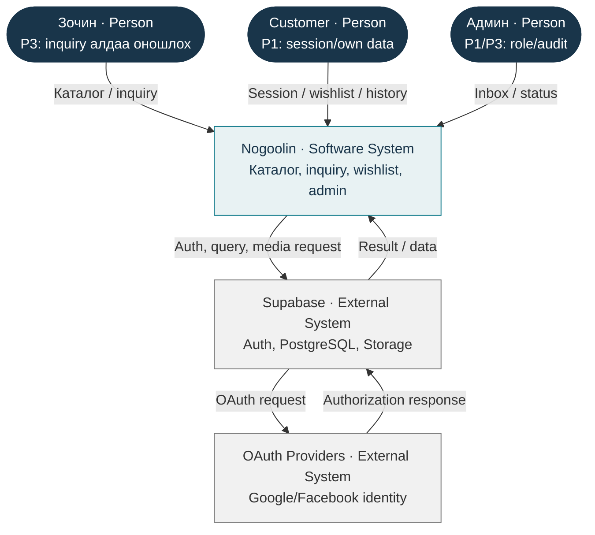
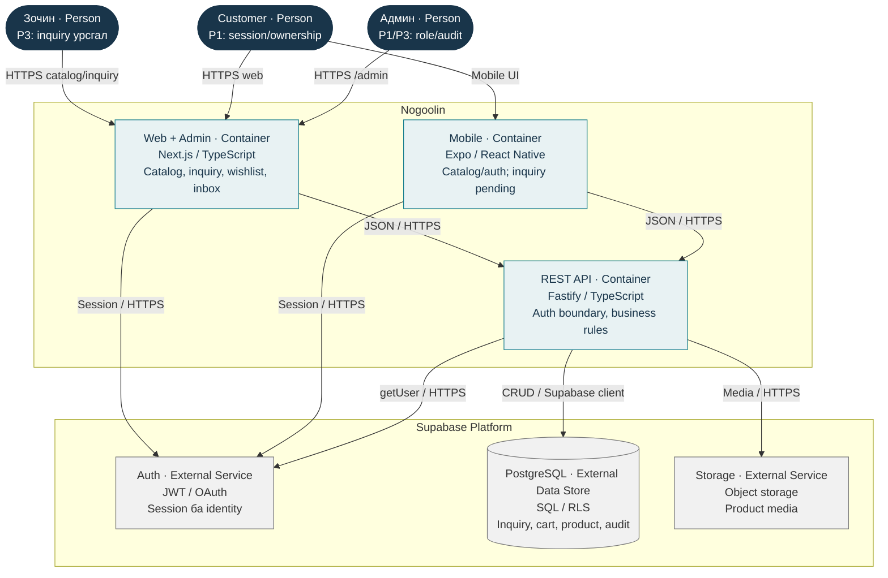
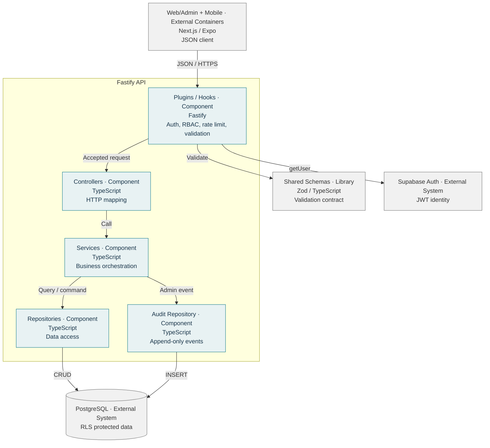
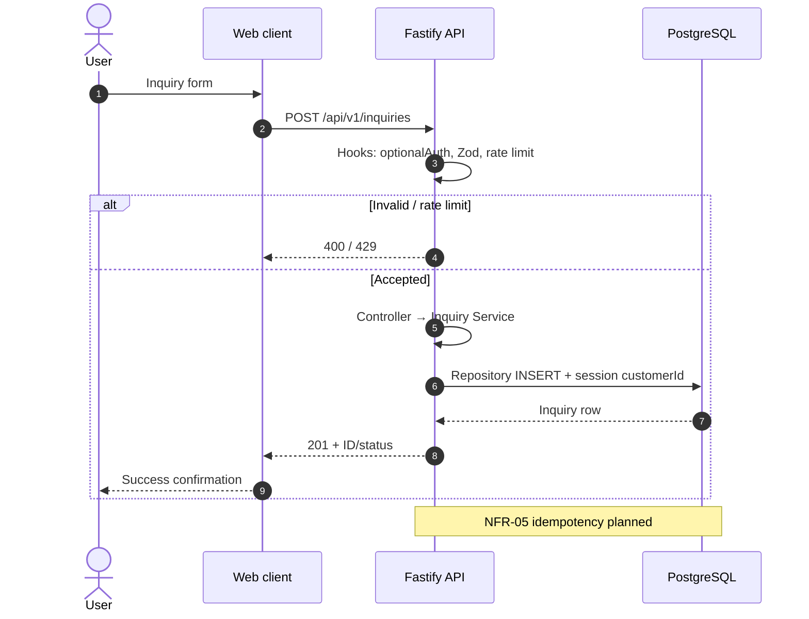
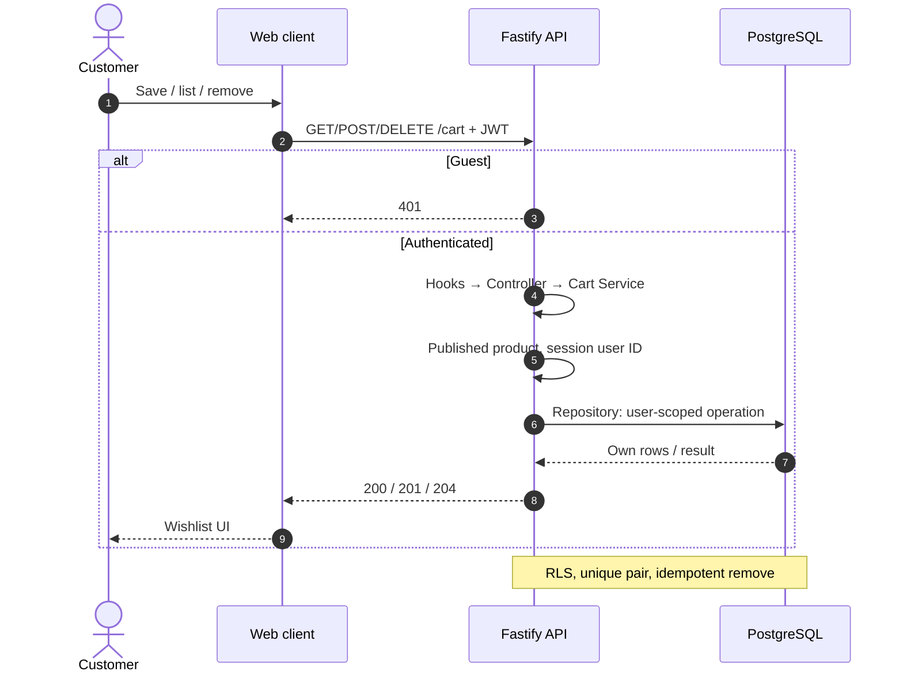
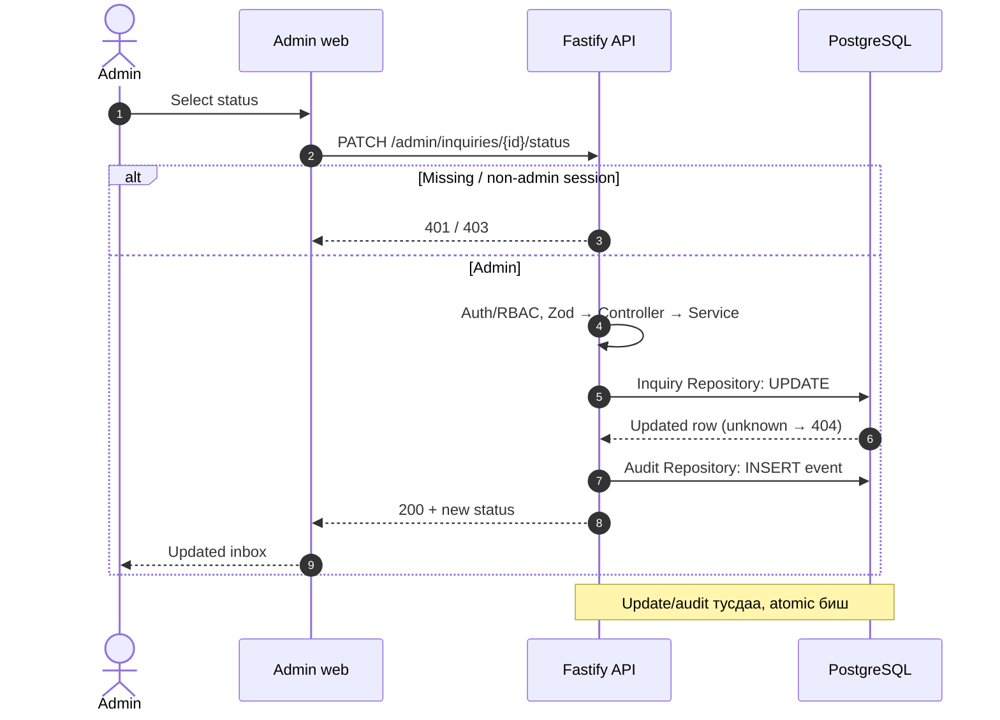
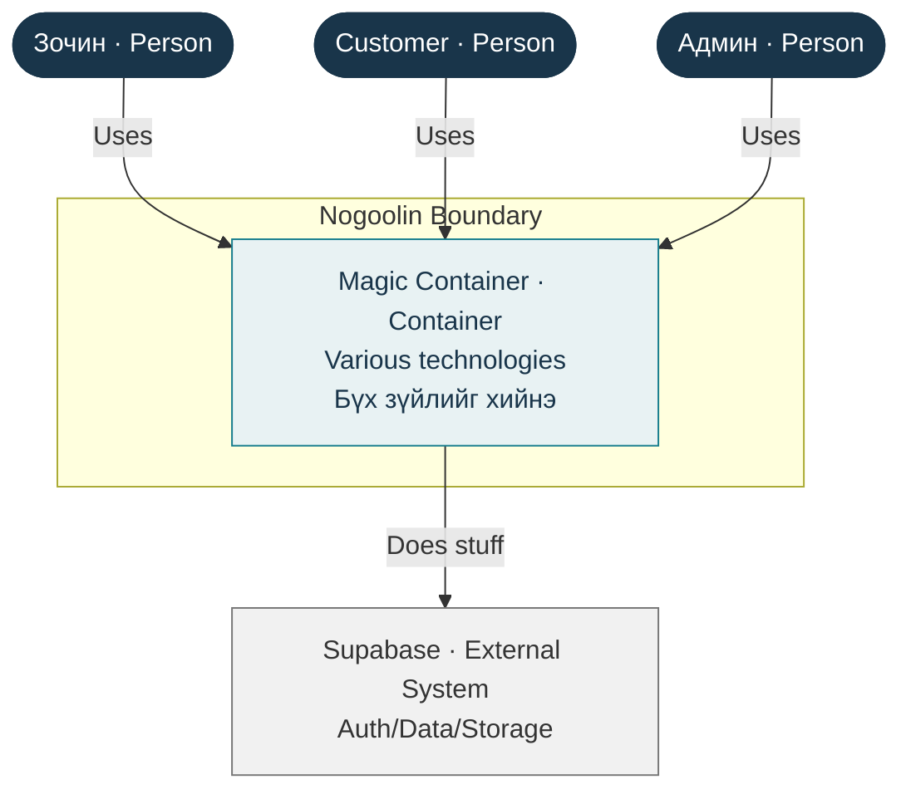

# Mermaid C4 sources

Typed flowcharts implement C4 static views; sequence diagrams implement C4 runtime views.

## c4-01-system-context

## c4-02-container

## c4-03-api-component

## c4-d01-inquiry

## c4-d02-wishlist

## c4-d03-admin-inquiry

## ue4-before-container

