# UE-4 — Container зураглалын Before/After засвар

## Аргачлал

Bhatti Ch.6-ийн гурван алхмыг хэрэглэв: эхлээд элемент, хилийн ноорог гаргах; уншигч хаанаас эхлэхийг тодруулах; box/arrow бүрийг утгатай label-тай болгох. Handout нь х.112/113/116 гэж заасан боловч локал номын хэвлэмэл хуудас дээр эдгээр гурван дэд гарчиг х.116-д хамт байна. Энд цаасан дээр зурсан эсвэл хүнээр review хийлгэсэн нотолгоо зохиогоогүй; editable Mermaid эхийг ноорог болгон ашиглав.

## Before — зориуд оруулсан anti-pattern

{width=100%}

“Magic Container” нь web, mobile, API-ийн ялгаа, технологи, хариуцлагыг нууж байна. “Does stuff” arrow нь ямар мэдээлэл дамжуулж байгааг хэлэхгүй. Энэ нь зөвхөн UE-4 сургалтын алдаатай зураг; ажиллаж буй system design гэж үзэхгүй.

## After — нэр, технологи, хариуцлага тодорхой болсон

{width=100%}

Chinchilla Ch.2 х.22–23-ын architecture reference нь харилцан хамааралтай хэсгүүдийг тайлбарлах зорилготой. After зурагт Web/Admin, Mobile, REST API-г тусдаа deployable unit болгон задалж, Supabase services-ийг хөрш системээр ялгав. Actor, request, authentication болон persistence замын label тодорхой болсон. Shared schema нь library учраас container биш; §5.2 component view-д reference хийнэ.

| Өмнөх зөрүү | Засвар | Үр дүн |
|---|---|---|
| Нэг “Magic” box | Web, Mobile, API болгож салгасан | Deployable хариуцлага харагдана |
| “Various technologies” | Next.js, Expo, Fastify | Stack тодорхой |
| “Does stuff” | JSON API, session, query/media label | Data flow ойлгомжтой |
| Бүх боломж бэлэн мэт | Mobile inquiry/wishlist incomplete | Бодит capability-г ялгасан |

