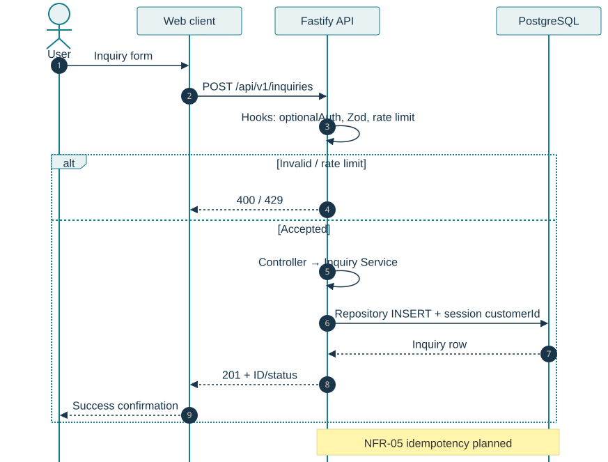
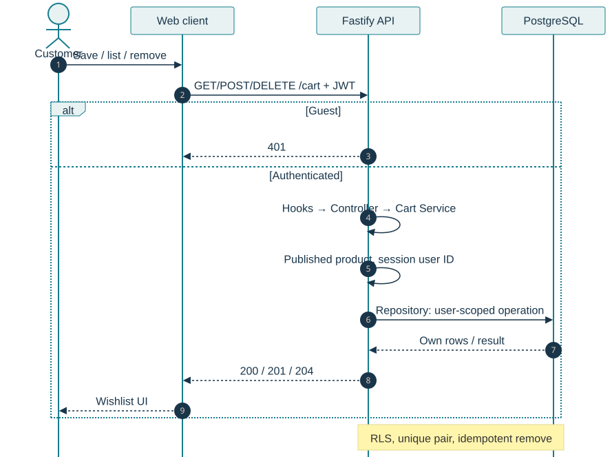
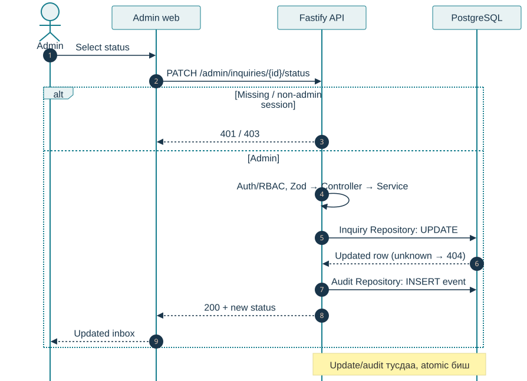

# Nogoolin архитектурын баримт бичиг

**arc42 v9 lean profile · ICSI438 Seminar 4 / M4 · Тэнгис · v0.1 draft · 2026-09-28**

Энэ баримт нь Nogoolin-ийн одоогийн код, Seminar 3-ын SRS болон шийдвэрийн бүртгэлийг нэг архитектурын зураглалд холбов. Arc42-ийн 12 хэсгийг хадгалж, §3, §5, §6-д C4 загварыг хэрэглэв. Week 04 Lab Assignment-ийн §1, §3, §5, гурван MADR, persona холбоо, ≥80% FR coverage болон UE-4 шаардлагыг энэ хувилбарт тусгав. Lecture 04 хараахан байхгүй.

| Талбар | Утга |
|---|---|
| Төсөл | Nogoolin |
| Зохиогч | Тэнгис |
| Хувилбар | v0.1 draft |
| Requirements baseline | [SRS v1.0 draft](../requirements/srs-v1.0.md), [20 мөртэй matrix](../requirements/traceability-matrix-v1.0.md) |
| Public repository | <https://github.com/Tengis01/Nogoolin> |
| Аргачлал | [arc42 v9](https://arc42.org/download/), [C4 model](https://c4model.com/) ба ADR |

# 1. Оршил ба зорилго

## 1.1 Системийн зорилго

Nogoolin нь Монголын шашны бүтээгдэхүүний каталог, хэрэглэгчийн inquiry, хадгалсан бүтээгдэхүүний жагсаалт болон админ удирдлагыг web, mobile, REST API-аар нийлүүлэх систем. Одоогийн M4 хүрээ нь SRS-д тогтоосон inquiry, wishlist, admin inquiry болон нүүрний fallback урсгалд төвлөрнө.

## 1.2 Оролцогч талууд

| Оролцогч | Архитектураас хүлээх зүйл |
|---|---|
| Зочин ба хэрэглэгч | Каталог үзэх, inquiry илгээх, өөрийн өгөгдөлд л хандах |
| Админ | Inquiry-г шүүх, төлөв солих, өөрчлөлтийг audit-д үлдээх |
| Тэнгис, хөгжүүлэгч | Нэг repository-д ойлгомжтой бүтэц, локал шалгалт, бага operational overhead |
| ICSI438 багш | SRS → architecture → decision холбоог шалгах боломж |

## 1.3 Архитектурын гол зорилгууд

1. **Өгөгдөл тусгаарлалт:** JWT, ownership filter, RBAC, RLS-ийг давхар хэрэглэж NFR-01-ийг хангах.
2. **Засварлах боломж:** Controller → Service → Repository хилийг хадгалж, UI/API/schema drift-ийг бууруулах.
3. **Хүртээмж ба fallback:** хөдөлгөөн багасгах тохиргоо, static hero-г хадгалж NFR-02-ыг хангах.
4. **Шалгаж болох build:** integration test үнэхээр ажилласан эсэхийг CI ялгаж NFR-03-ын false-green эрсдэлийг арилгах.
5. **Хариу өгөх хугацаа:** каталогийн замыг NFR-04-ийн 2.0 секундийн босготой уялдуулах.

# 2. Хязгаарлалт

| Төрөл | Хязгаарлалт |
|---|---|
| Баг | Нэг хөгжүүлэгч; microservice-ийн нэмэлт ажиллагааг даахгүй |
| Технологи | TypeScript monorepo; Next.js, Expo, Fastify, Supabase, Zod |
| Архитектур | Нэг Fastify backend; controller/service/repository давхарга |
| Өгөгдөл | Local-first Supabase CLI; cloud project Phase 6 хүртэл үүсээгүй |
| Аюулгүй байдал | Secret зөвхөн environment variable-д; RLS бүх хүснэгтэд |
| Хүргэлт | `delivery_enabled=false`; order урсгал M4-ийн идэвхтэй scope биш |
| Нотолгоо | Planned test-ийг executed/verified гэж тэмдэглэхгүй |

# 3. Контекст ба хамрах хүрээ

Arc42 §3 нь системийн хил, хэрэглэгч болон хөрш системийг харуулна. C4 System Context нь Nogoolin-ийг нэг black box болгон үзүүлж, дотоод технологийн дэлгэрэнгүйг §5 руу үлдээв.

{width=100%}

*Mermaid эх: [c4-01-system-context.mmd](../ICSI438/sem4/diagrams/c4-01-system-context.mmd).*

**Зургийн тэмдэглэгээ:** Person нь хүний role, Software System нь нэг систем, Container нь ажиллах application, Component нь API доторх нэгж. Цэнхэр хүрээ Nogoolin-ийн эзэмшил, саарал хүрээ external system. Сум бүр data flow label-тай. Mermaid flowchart дээр C4 type, name, technology, responsibility-г ил тод бичсэн; runtime нь C4-ийн зөвшөөрсөн sequence style.

## 3.1 Бизнес контекст

| Харилцагч | Nogoolin руу орох мэдээлэл | Nogoolin-оос гарах мэдээлэл |
|---|---|---|
| Зочин | Каталогийн хайлт, inquiry form | Бүтээгдэхүүн, inquiry confirmation |
| Хэрэглэгч | Session, inquiry, wishlist үйлдэл | Өөрийн inquiry, хадгалсан бүтээгдэхүүн |
| Админ | Inquiry filter, status command | Inbox, шинэ төлөв, audit үр дүн |
| OAuth provider | Authorization response | OAuth authorization request |
| Supabase platform | Auth/storage/database response | Auth, query, storage request |

## 3.2 Техникийн контекст

- Browser ба mobile client нь HTTPS JSON API-аар Fastify backend-тай харилцана.
- Web/mobile нь Supabase Auth-тай session үүсгэнэ; API JWT-г шалгана.
- Repository давхарга PostgreSQL болон Storage-тай Supabase client-аар харилцана.
- Production-ийн Cloudflare, Vercel, Railway нь төлөвлөсөн target; local development-д localhost ба Supabase CLI stack хэрэглэгдэнэ.

## 3.3 W1 persona-тай холбоо

W1-д нэг хөгжүүлэгч persona, Тэнгис, болон P1/P2/P3 pain point байсан. Тэдгээрийг шинэ хэрэглэгчтэй хийсэн ярилцлага гэж өөрчлөхгүй. Доорх гурван external role нь Nogoolin-ийн бизнес actor; W1 persona-ийн оношлох хэрэгцээг role бүрийн architecture boundary-д шилжүүлэн холбов.

| External actor | W1 холбоо | Nogoolin-д тайлбарласан холбоо |
|---|---|---|
| Зочин | [P3: local/pipeline ялгаа](../ICSI438/sem1/wiki/02_audience_persona.md) | Inquiry response ба алдаа аль API/DB хэсэгт гарсныг ялгах |
| Customer | [P1: session алдагдах](../ICSI438/sem1/wiki/02_audience_persona.md) | Session, own inquiry, wishlist boundary; P-NG-01 |
| Админ | [P1, P3](../ICSI438/sem1/wiki/02_audience_persona.md) | JWT/role болон data query/audit-ийг тусад нь шалгах |

Энэ нь гурван role-ийг W1-ийн нэг persona-тай холбосон mapping; W1-д гурван тусдаа persona байсан гэж зарлаагүй. [W2 pivot](../ICSI438/sem2/wiki/persona-and-pivot.md) нь шилжилтийн үндэслэлийг хадгална.

# 4. Шийдлийн стратеги

| Зорилго/хязгаарлалт | Стратеги | Холбогдох шийдвэр |
|---|---|---|
| Solo developer, бага ажиллагаа | Нэг Fastify backend бүхий layered monolith | [ADR-007](adr/adr-007-layered-monolith.md) |
| TypeScript REST API | Fastify plugin/hook болон schema validation | [ADR-003](adr/adr-003-fastify.md) |
| Relational data, auth, storage, RLS | Supabase platform, repository abstraction | [ADR-005](adr/adr-005-supabase.md) |
| SEO ба admin/public web | Next.js App Router; одоогийн ADR-006 |
| Shared contract | Zod schema-г `packages/validation-schemas`-д төвлөрүүлэх |
| Local-first security test | Supabase CLI migrations; одоогийн ADR-011 |

Энэ хэсэг сонголтыг товч харуулна. Static бүтэц §5, runtime харилцан үйлчлэл §6, бүрэн decision reasoning §9-ийн ADR холбоосуудад байна.

# 5. Бүрэлдэхүүний зураглал

## 5.1 Level 1 — Container view

{width=100%}

*Mermaid эх: [c4-02-container.mmd](../ICSI438/sem4/diagrams/c4-02-container.mmd).*

| Container | Үүрэг | Технологи ба code location |
|---|---|---|
| Web + Admin | Public catalog, inquiry, wishlist, profile, admin inbox | Next.js; `apps/web` |
| Mobile | Catalog, auth; inquiry/wishlist mobile хэсэг дутуу | Expo/React Native; `apps/mobile` |
| REST API | Auth boundary, business rule, persistence orchestration | Fastify/TypeScript; `backend/api` |
| Shared validation library | Web/API contract; deployable container биш | Zod; `packages/validation-schemas` |
| Supabase Auth | Session, JWT, OAuth bridge | Local stack; cloud deferred |
| PostgreSQL | Product, inquiry, cart, audit ба RLS | `supabase/migrations` |
| Storage | Product media | Supabase Storage |

## 5.2 Level 2 — Fastify API component view

{width=100%}

*Mermaid эх: [c4-03-api-component.mmd](../ICSI438/sem4/diagrams/c4-03-api-component.mmd).*

| Component | Үүрэг | Хил ба requirement |
|---|---|---|
| Plugins/Hooks | Helmet, CORS, rate limit, auth, RBAC, validation | FR-05, FR-10, NFR-01 |
| Controllers | HTTP input/output, status code, route composition | FR-01…14 |
| Services | Business rule, state transition, ownership orchestration | FR-02, FR-09, FR-11…14, NFR-05 |
| Repositories | Supabase query ба DB-specific mapping | FR-01…14, NFR-01 |
| Shared schemas | Request/response validation contract | FR-03, NFR-03 |
| Audit repository | Admin mutation болон denied-access audit | FR-09, NFR-01 |

Controller дотор business logic, service дотор шууд database query хийхгүй. Энэ хил нь ADR-007-ийн гол үр дагавар бөгөөд кодын одоогийн folder structure-тэй таарна.

## 5.3 Building block → SRS холбоо

| Building block | Хариуцах requirement ID |
|---|---|
| Web public/inquiry/history | FR-01, FR-03, FR-04, FR-06, FR-15; NFR-02/04 |
| Web admin inbox | FR-07, FR-08, FR-09; NFR-01 |
| Web wishlist | FR-10, FR-11, FR-12, FR-13, FR-14; NFR-01 |
| API plugins/auth/validation | FR-02, FR-03, FR-05, FR-10; NFR-01 |
| Inquiry controller/service/repository | FR-01, FR-02, FR-04, FR-06, FR-07, FR-08, FR-09; NFR-05 planned |
| Cart controller/service/repository | FR-10, FR-11, FR-12, FR-13, FR-14 |
| PostgreSQL/Auth/audit | FR-01, FR-02, FR-06, FR-09, FR-12; NFR-01 |
| CI/deployment tooling | NFR-03 gap; бүрэлдэхүүнд оноосон боловч хэрэгжээгүй |

Бүх ID-ийн [SRS эх](../requirements/srs-v1.0.md) болон [20 мөрийн architecture mapping](architecture-traceability.md) холбоотой. Functional mapping coverage **15/15 = 100%**, DoD-ийн ≥80% буюу 12/15 босгыг хангана. **Orphan FR: 0**. NFR-03/05 нь orphan биш, хариуцах building block байгаа ч хэрэгжилтийн gap; W5 төлөвлөгөөнд үлдээнэ. Coverage нь runtime test pass гэсэн үг биш.

# 6. Ажиллах үеийн зураглал

## 6.1 Inquiry илгээх

{width=100%}

*Mermaid эх: [c4-d01-inquiry.mmd](../ICSI438/sem4/diagrams/c4-d01-inquiry.mmd).*

Guest эсвэл customer form илгээхэд client ба API ижил Zod contract ашиглана. Hook нь optional session, input болон rate limit-ийг шалгана. Service нь inquiry үүсгэж repository-оор PostgreSQL-д хадгална. Invalid input `400`, хэтрэлт `429`, амжилт `201` байна. Энэ scenario FR-01…06, NFR-01, NFR-04, NFR-05-тай холбоотой.

## 6.2 Wishlist жагсаалт ба хадгалалт

{width=100%}

*Mermaid эх: [c4-d02-wishlist.mmd](../ICSI438/sem4/diagrams/c4-d02-wishlist.mmd).*

Guest API түвшинд `401` авна. Customer session баталгаажсаны дараа service published product болон ownership-ийг шалгаж, repository unique user-product constraint-тай ажиллана. Remove нь idempotent байна. Энэ scenario FR-10…14 ба NFR-01-ийг хамарна.

## 6.3 Админ inquiry төлөв шинэчлэх

{width=100%}

*Mermaid эх: [c4-d03-admin-inquiry.mmd](../ICSI438/sem4/diagrams/c4-d03-admin-inquiry.mmd).*

Admin inbox command API-д очиход JWT ба role шалгана. Schema зөвшөөрөгдсөн status утгыг шалгаж, service шинэчлэлт хийж, primary update амжилттай болсны дараа audit row нэмнэ. Customer `403`, invalid status `400`, unknown ID `404` авна. Энэ scenario FR-07…09 ба NFR-01-тэй холбоотой.

# 7. Байршуулалтын зураглал

| Орчин | Web | API | Data/Auth/Storage | Төлөв |
|---|---|---|---|---|
| Local | `localhost:3000` | `localhost:3001` | Supabase CLI Docker stack | Ашиглаж буй development target |
| Production | Vercel | Railway Docker | Supabase cloud, Singapore | Phase 6-д төлөвлөсөн; ажиллаж буй мэт батлаагүй |
| Edge | Cloudflare DNS/WAF | API domain proxy | Хамаарахгүй | Production target |
| Mobile distribution | Expo dev client / EAS | Ижил REST API | Supabase Auth | EAS build manual trigger |

Нууц утгууд diagram эсвэл баримтад бичигдэхгүй. Production topology нь `docs/phase-0/09-deployment.md`-ийн зорилтот загвар; cloud project одоогоор байхгүй.

# 8. Хөндлөн огтлох ойлголтууд

| Ойлголт | Хэрэгжүүлэх зарчим |
|---|---|
| Authentication | Supabase session; API JWT verification |
| Authorization | `requireAuth`/`requireAdmin`, ownership filter, PostgreSQL RLS |
| Validation | Shared Zod schema; client validation нь UX, server validation нь заавал |
| Error contract | Тогтвортой HTTP status болон хэрэглэгчид ойлгомжтой message |
| Audit | Admin mutation ба denied access-ийг append-only log-д үлдээх |
| Configuration | Environment variable; secret repository-д хадгалахгүй |
| Resilience | Reduced motion, WebGL static fallback, idempotent remove |
| Observability | Одоогоор structured application log ба audit; production monitoring deferred |

# 9. Архитектурын шийдвэрүүд

US-4.3-ийн Tech Stack, Persistence, Interface ангилал бүрд нэг MADR бичив. ADR-003/005 нь одоогийн шийдвэрийн дэлгэрэнгүй; M4-IF-01 нь одоогийн REST contract-ийг баримтжуулсан course record. ADR-007 нь нэмэлт архитектурын үндэслэлээр тусдаа эхэд хадгалагдана.

| ID | Шийдвэр | Status | Requirements/C4 холбоо |
|---|---|---|---|
| [ADR-003](adr/adr-003-fastify.md) | Fastify over Express | Accepted | FR-01…14, NFR-03/04; C4-02/03/D01…D03 |
| [ADR-005](adr/adr-005-supabase.md) | Supabase over Firebase/self-hosted PostgreSQL | Accepted | FR-01…14, NFR-01/05; бүх data/auth view |
| [M4-IF-01](adr/m4-if-01-rest-interface.md) | Versioned REST + shared Zod contract | Accepted, existing implementation | FR-01…14, NFR-01/03; C4-02/03 |

ADR-006 Next.js, ADR-010 manual EAS build, ADR-011 local-first DB нь [decision log](../../agent-context/DECISIONS.md)-д хэвээр бөгөөд энэ M4-д бүрэн карт болгон давтаагүй.

# 10. Чанарын шаардлага

| ID | Quality scenario | Архитектурын хариу | Verification төлөв |
|---|---|---|---|
| NFR-01 | A хэрэглэгч B-ийн inquiry/wishlist-г харахгүй | JWT + ownership + RLS; C4-D01/D02/D03 | Partial inspection; runtime matrix planned |
| NFR-02 | Reduced motion үед CTA 1 секундэд бэлэн | Web container static/reduced-motion path | Implemented; test planned |
| NFR-03 | DB integration suite skip бол CI fail | Build/deployment gate; local Supabase dependency | Gap; planned W9 |
| NFR-04 | 10 run-ийн 9-д каталог ≤2.0 s | SSR/SSG, Fastify, indexed PostgreSQL query | Defined; measurement not executed |
| NFR-05 | Ижил idempotency key 24 цагт нэг inquiry | Service/repository key store шаардлагатай | Planned; not implemented |

# 11. Эрсдэл ба техникийн өр

| Эрсдэл/өр | Нөлөө | Одоогийн хариу |
|---|---|---|
| CI local DB provision хийхгүй | Integration test бүгд skip хийгээд green болох | NFR-03 gap гэж ил тод тэмдэглэсэн |
| Inquiry idempotency key store байхгүй | Retry давхар inquiry үүсгэж магадгүй | NFR-05 planned; ADR шаардлагатай байж болно |
| Phase 0-ийн Express/хуучин path | Architecture drift, буруу diagram | Код ба decision log-ийг M4 source болгосон |
| Production service үүсээгүй | Deployment зураг нотолгоо мэт ойлгогдох | §7-д target гэж тэмдэглэсэн |
| Mobile inquiry/wishlist дутуу | Container capability зөрөх | C4-02 болон status-д gap гэж тэмдэглэсэн |
| Mermaid renderer/layout өөрчлөгдөх | Renderer update layout эвдэх | CLI 11.17.0 pin, lockfile, SVG diff ба targeted visual QA |

# 12. Нэр томьёо

| Нэр | Тайлбар |
|---|---|
| arc42 | Architecture documentation-ийн 12 хэсэгтэй бүтэц |
| C4 | System Context, Container, Component, Code гэсэн zoom түвшний загвар |
| Container | Тусдаа ажиллах эсвэл deploy хийх application/data store |
| Component | Container доторх тодорхой үүрэгтэй нэгж |
| Dynamic view | Нэг feature ажиллах үеийн элементүүдийн дараалал |
| ADR | Нэг архитектурын шийдвэрийн context, choice, consequence бүртгэл |
| RLS | PostgreSQL Row Level Security |
| Layered monolith | Нэг deployable API дотор хариуцлагаар тусгаарласан давхаргууд |

## Эх сурвалж

- [arc42 template v9 download](https://arc42.org/download/)
- [arc42 §3 — Context and Scope](https://docs.arc42.org/section-3/)
- [arc42 §5 — Building Block View](https://docs.arc42.org/section-5/)
- [arc42 §6 — Runtime View](https://docs.arc42.org/section-6/)
- [C4 model — System Context](https://c4model.com/diagrams/system-context)
- [C4 model — Dynamic diagram](https://c4model.com/diagrams/dynamic)
- [Mermaid C4 syntax](https://mermaid.js.org/syntax/c4)
- [ADR templates](https://adr.github.io/adr-templates/)
